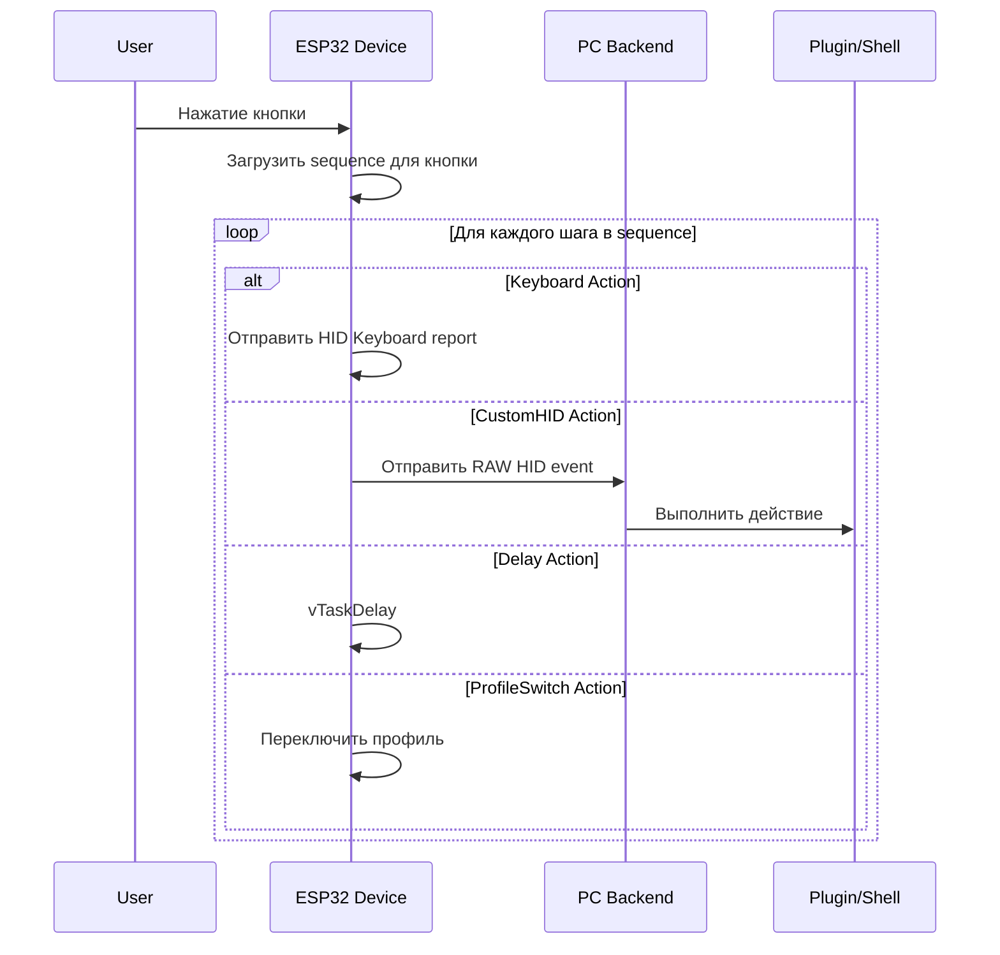

# Спецификация: Составные команды (Action Sequences)

## Обзор

Составные команды позволяют назначить на одну кнопку последовательность действий, выполняемых одно за другим с опциональными задержками.

**Пример использования:**
```
Кнопка "Git Push" →
  1. Shell: "git push"
  2. Delay: 200ms
  3. Shell: "curl https://api.telegram.org/..."
```

**Поддерживаемые типы действий в последовательности:**
- **Keyboard** - эмуляция нажатий клавиш, ввод текста
- **Shell** - выполнение shell-команд на PC (через Backend)
- **CustomHID** - отправка RAW HID данных (обрабатывается Backend/плагинами)
- **ProfileSwitch** - переключение профиля
- **Folder** - навигация по папкам
- **Delay** - задержка между действиями

## Архитектура



## Изменения в прошивке

### 1. Новые типы в profile_types.h

```c
// Добавить новые типы действий
typedef enum {
    ACTION_TYPE_NONE = 0x00,
    ACTION_TYPE_KEYBOARD = 0x01,
    ACTION_TYPE_CUSTOM_HID = 0x02,
    ACTION_TYPE_PROFILE_SWITCH = 0x03,
    ACTION_TYPE_FOLDER = 0x04,
    ACTION_TYPE_DELAY = 0x05,        // НОВЫЙ: задержка
    ACTION_TYPE_SHELL = 0x06,        // НОВЫЙ: shell-команда (выполняется на PC)
    ACTION_TYPE_SEQUENCE = 0x07,     // НОВЫЙ: последовательность
} action_type_t;

// Максимальное количество шагов в последовательности
#define MAX_SEQUENCE_STEPS 16

// Структура одного шага последовательности
typedef struct {
    action_type_t action_type;       // Тип действия (не может быть SEQUENCE)
    uint16_t delay_before_ms;        // Задержка ПЕРЕД выполнением (0-65535 ms)
    uint16_t action_data_len;        // Длина данных действия
    uint8_t action_data[ACTION_DATA_MAX_LEN]; // Данные действия
} sequence_step_t;

// Структура последовательности
typedef struct {
    uint8_t num_steps;               // Количество шагов (1-16)
    sequence_step_t steps[MAX_SEQUENCE_STEPS];
} action_sequence_t;
```

### 2. Shell-команды (ACTION_TYPE_SHELL)

Shell-команды выполняются на PC через Backend. Устройство отправляет событие с командой, Backend получает его и выполняет.

```c
// Формат action_data для ACTION_TYPE_SHELL:
// Байт 0: Флаги (зарезервировано, 0x00)
// Байт 1-N: Shell команда (UTF-8, null-terminated)

// Пример: "git push origin main"
// action_data = {0x00, 'g', 'i', 't', ' ', 'p', 'u', 's', 'h', ...}
```

**Важно:** Shell-команды требуют подключения к PC с запущенным Backend. Устройство отправляет RAW HID событие с типом `ACTION_TYPE_SHELL`, Backend парсит команду и выполняет её через `Process.Start()`.

### 2. Изменения в button_config_t

```c
typedef struct {
    uint8_t button_id;
    action_type_t action_type;
    uint16_t action_data_len;
    
    union {
        uint8_t action_data[ACTION_DATA_MAX_LEN];  // Для простых действий
        action_sequence_t sequence;                 // Для последовательностей
    };
    
    // ... остальные поля без изменений
    uint8_t folder_id;
    uint8_t led_r, led_g, led_b;
    uint8_t led_brightness;
    led_effect_t led_effect;
    uint32_t image_offset;
    uint32_t image_size;
    uint8_t image_format;
} button_config_t;
```

### 3. Изменения в action_executor.c

```c
// Новая функция для выполнения одного шага
static esp_err_t execute_single_action(action_type_t type, 
                                        const uint8_t* data, 
                                        uint16_t data_len) {
    switch (type) {
        case ACTION_TYPE_KEYBOARD:
            return execute_keyboard_action(data, data_len);
        case ACTION_TYPE_CUSTOM_HID:
            return execute_custom_hid_action(data, data_len);
        case ACTION_TYPE_PROFILE_SWITCH:
            return execute_profile_switch(data, data_len);
        case ACTION_TYPE_FOLDER:
            return execute_folder_action(data, data_len);
        case ACTION_TYPE_DELAY:
            // Delay обрабатывается отдельно
            return ESP_OK;
        default:
            return ESP_ERR_INVALID_ARG;
    }
}

// Функция выполнения последовательности
static esp_err_t execute_sequence(const action_sequence_t* seq) {
    ESP_LOGI(TAG, "Executing sequence with %d steps", seq->num_steps);
    
    for (int i = 0; i < seq->num_steps && i < MAX_SEQUENCE_STEPS; i++) {
        const sequence_step_t* step = &seq->steps[i];
        
        // Задержка перед действием
        if (step->delay_before_ms > 0) {
            ESP_LOGD(TAG, "Step %d: delay %d ms", i, step->delay_before_ms);
            vTaskDelay(pdMS_TO_TICKS(step->delay_before_ms));
        }
        
        // Выполнение действия
        ESP_LOGI(TAG, "Step %d: action type %d", i, step->action_type);
        esp_err_t ret = execute_single_action(
            step->action_type, 
            step->action_data, 
            step->action_data_len
        );
        
        if (ret != ESP_OK) {
            ESP_LOGE(TAG, "Step %d failed: %s", i, esp_err_to_name(ret));
            // Продолжаем выполнение остальных шагов или прерываем?
            // Рекомендация: продолжать, но логировать ошибку
        }
    }
    
    return ESP_OK;
}

// Обновлённая функция action_execute
esp_err_t action_execute(uint8_t button_id) {
    // ... существующая валидация ...
    
    button_config_t* btn = profile_get_button_config(button_id);
    
    switch (btn->action_type) {
        // ... существующие case ...
        
        case ACTION_TYPE_SEQUENCE:
            return execute_sequence(&btn->sequence);
            
        // ...
    }
}
```

### 4. Изменения в протоколе

Команда `0x30 - SET_BUTTON_ACTION` должна поддерживать новый формат для последовательностей:

```
Для ACTION_TYPE_SEQUENCE:
- Байт 0: Profile ID
- Байт 1: Button ID
- Байт 2: Action type = 0x07 (SEQUENCE)
- Байт 3: Number of steps (1-16)
- Байт 4+: Данные шагов (сериализованные)

Формат одного шага:
- Байт 0: Step action type
- Байт 1-2: Delay before (ms, little-endian)
- Байт 3-4: Action data length
- Байт 5+: Action data
```

**Важно:** Из-за ограничения размера пакета (64 байта), для больших последовательностей потребуется многопакетная передача. Рекомендуется использовать механизм, аналогичный передаче изображений:

```
0x31 - START_SEQUENCE_TRANSFER
0x32 - SEQUENCE_DATA_CHUNK  
0x33 - END_SEQUENCE_TRANSFER
```

## Изменения в C# (Core)

### 1. Новые модели в ActionConfig.cs

```csharp
/// <summary>
/// Действие задержки
/// </summary>
public class DelayAction : ActionConfig
{
    public override ActionType ActionType => ActionType.Delay;
    
    /// <summary>
    /// Задержка в миллисекундах (0-65535)
    /// </summary>
    public ushort DelayMs { get; set; }
    
    public override byte[] ToBytes()
    {
        return BitConverter.GetBytes(DelayMs);
    }
}

/// <summary>
/// Действие выполнения shell-команды на PC
/// </summary>
public class ShellAction : ActionConfig
{
    public override ActionType ActionType => ActionType.Shell;
    
    /// <summary>
    /// Shell-команда для выполнения
    /// </summary>
    public string Command { get; set; } = string.Empty;
    
    /// <summary>
    /// Рабочая директория (опционально)
    /// </summary>
    public string? WorkingDirectory { get; set; }
    
    /// <summary>
    /// Ожидать завершения команды перед следующим шагом
    /// </summary>
    public bool WaitForExit { get; set; } = true;
    
    /// <summary>
    /// Таймаут ожидания в миллисекундах (0 = без таймаута)
    /// </summary>
    public int TimeoutMs { get; set; } = 30000;
    
    public override byte[] ToBytes()
    {
        var data = new List<byte>();
        
        // Флаги: bit 0 = WaitForExit
        byte flags = 0;
        if (WaitForExit) flags |= 0x01;
        data.Add(flags);
        
        // Команда (UTF-8, null-terminated)
        var commandBytes = System.Text.Encoding.UTF8.GetBytes(Command);
        data.AddRange(commandBytes);
        data.Add(0); // null terminator
        
        return data.ToArray();
    }
}

/// <summary>
/// Один шаг в последовательности действий
/// </summary>
public class SequenceStep
{
    /// <summary>
    /// Действие для выполнения
    /// </summary>
    public ActionConfig Action { get; set; } = new KeyboardAction();
    
    /// <summary>
    /// Задержка ПЕРЕД выполнением действия (мс)
    /// </summary>
    public ushort DelayBeforeMs { get; set; }
}

/// <summary>
/// Последовательность действий
/// </summary>
public class SequenceAction : ActionConfig
{
    public override ActionType ActionType => ActionType.Sequence;
    
    /// <summary>
    /// Шаги последовательности (максимум 16)
    /// </summary>
    public List<SequenceStep> Steps { get; set; } = new();
    
    public override byte[] ToBytes()
    {
        var data = new List<byte>();
        
        // Количество шагов
        data.Add((byte)Math.Min(Steps.Count, 16));
        
        foreach (var step in Steps.Take(16))
        {
            // Тип действия шага
            data.Add((byte)step.Action.ActionType);
            
            // Задержка перед (2 байта, little-endian)
            data.AddRange(BitConverter.GetBytes(step.DelayBeforeMs));
            
            // Данные действия
            var actionData = step.Action.ToBytes();
            data.AddRange(BitConverter.GetBytes((ushort)actionData.Length));
            data.AddRange(actionData);
        }
        
        return data.ToArray();
    }
}
```

### 2. Обновление ActionType.cs

```csharp
public enum ActionType : byte
{
    None = 0x00,
    Keyboard = 0x01,
    CustomHid = 0x02,
    ProfileSwitch = 0x03,
    Folder = 0x04,
    Delay = 0x05,      // НОВЫЙ
    Shell = 0x06,      // НОВЫЙ: shell-команда на PC
    Sequence = 0x07,   // НОВЫЙ: последовательность
}
```

### 3. Обновление ActionConfigConverter

```csharp
ActionConfig? result = actionType switch
{
    ActionType.Keyboard => new KeyboardAction(),
    ActionType.CustomHid => new CustomHidAction(),
    ActionType.ProfileSwitch => new ProfileSwitchAction(),
    ActionType.Folder => new FolderAction(),
    ActionType.Delay => new DelayAction(),
    ActionType.Shell => new ShellAction(),
    ActionType.Sequence => new SequenceAction(),
    _ => null
};
```

## Изменения в Backend

### 1. Обновление IpcCommandHandler.cs

Добавить поддержку новых типов в `HandleSetButtonAction`:

```csharp
action = (ActionType)actionType switch
{
    ActionType.Keyboard => actionObj.ToObject<KeyboardAction>(),
    ActionType.ProfileSwitch => actionObj.ToObject<ProfileSwitchAction>(),
    ActionType.CustomHid => actionObj.ToObject<CustomHidAction>(),
    ActionType.Folder => actionObj.ToObject<FolderAction>(),
    ActionType.Delay => actionObj.ToObject<DelayAction>(),
    ActionType.Shell => actionObj.ToObject<ShellAction>(),
    ActionType.Sequence => actionObj.ToObject<SequenceAction>(),
    _ => null
};
```

### 2. Обработка Shell-команд в Backend

Добавить новый обработчик для Shell-событий от устройства:

```csharp
// В EventRouter.cs или новом ShellCommandExecutor.cs
public class ShellCommandExecutor
{
    private readonly ILogger<ShellCommandExecutor> _logger;
    
    public async Task<ShellResult> ExecuteAsync(ShellAction action)
    {
        _logger.LogInformation("Executing shell command: {Command}", action.Command);
        
        try
        {
            var startInfo = new ProcessStartInfo
            {
                FileName = GetShellExecutable(),
                Arguments = GetShellArguments(action.Command),
                WorkingDirectory = action.WorkingDirectory ?? Environment.CurrentDirectory,
                RedirectStandardOutput = true,
                RedirectStandardError = true,
                UseShellExecute = false,
                CreateNoWindow = true
            };
            
            using var process = new Process { StartInfo = startInfo };
            process.Start();
            
            if (action.WaitForExit)
            {
                var completed = await Task.Run(() =>
                    process.WaitForExit(action.TimeoutMs > 0 ? action.TimeoutMs : -1));
                    
                if (!completed)
                {
                    process.Kill();
                    return new ShellResult { Success = false, Error = "Timeout" };
                }
                
                return new ShellResult
                {
                    Success = process.ExitCode == 0,
                    ExitCode = process.ExitCode,
                    Output = await process.StandardOutput.ReadToEndAsync(),
                    Error = await process.StandardError.ReadToEndAsync()
                };
            }
            
            return new ShellResult { Success = true };
        }
        catch (Exception ex)
        {
            _logger.LogError(ex, "Shell command failed");
            return new ShellResult { Success = false, Error = ex.Message };
        }
    }
    
    private string GetShellExecutable()
    {
        return RuntimeInformation.IsOSPlatform(OSPlatform.Windows)
            ? "cmd.exe"
            : "/bin/bash";
    }
    
    private string GetShellArguments(string command)
    {
        return RuntimeInformation.IsOSPlatform(OSPlatform.Windows)
            ? $"/c {command}"
            : $"-c \"{command}\"";
    }
}

public class ShellResult
{
    public bool Success { get; set; }
    public int ExitCode { get; set; }
    public string? Output { get; set; }
    public string? Error { get; set; }
}
```

### 3. Обработка событий от устройства

Backend уже обрабатывает события `BUTTON_PRESSED`. Нужно добавить обработку `ACTION_TYPE_SHELL`:

```csharp
// В DeviceManager.cs или EventRouter.cs
private async void OnDeviceEvent(object? sender, DeviceEventArgs e)
{
    if (e.EventType == EventType.ButtonPressed)
    {
        var actionType = (ActionType)e.Payload[2];
        
        switch (actionType)
        {
            case ActionType.Shell:
                // Парсим shell-команду из payload
                var command = Encoding.UTF8.GetString(e.Payload, 4, e.Payload.Length - 4)
                    .TrimEnd('\0');
                var shellAction = new ShellAction { Command = command };
                await _shellExecutor.ExecuteAsync(shellAction);
                break;
                
            case ActionType.CustomHid:
                // Существующая логика для плагинов
                await _pluginManager.HandleCustomHidAsync(e.Payload);
                break;
        }
    }
}
```

## Изменения в UI

### 1. Новый компонент SequenceEditor

```
┌─────────────────────────────────────────────────────────┐
│ Action Type: [Sequence ▼]                               │
├─────────────────────────────────────────────────────────┤
│ Steps:                                                  │
│ ┌─────────────────────────────────────────────────────┐ │
│ │ 1. [Shell ▼]    "git push"             [⏱ 0ms] [🗑] │ │
│ │ 2. [Delay ▼]    200ms                  [⏱ 0ms] [🗑] │ │
│ │ 3. [Shell ▼]    "curl https://..."     [⏱ 0ms] [🗑] │ │
│ │ 4. [Keyboard ▼] Ctrl+S                 [⏱ 0ms] [🗑] │ │
│ └─────────────────────────────────────────────────────┘ │
│                                                         │
│ [+ Add Step]                                            │
│                                                         │
│ Total steps: 4/16                                       │
└─────────────────────────────────────────────────────────┘
```

### 2. Обновление ButtonConfigDialogViewModel

```csharp
// Доступные типы действий для шагов последовательности
// (Sequence не может содержать Sequence - избегаем рекурсии)
public ObservableCollection<ActionType> AvailableStepActionTypes { get; } = new()
{
    ActionType.Keyboard,
    ActionType.Shell,        // НОВЫЙ
    ActionType.CustomHid,
    ActionType.ProfileSwitch,
    ActionType.Folder,
    ActionType.Delay,
};

// Новые свойства
[ObservableProperty]
private ObservableCollection<SequenceStepViewModel> _sequenceSteps = new();

public bool IsSequenceAction => SelectedActionType == ActionType.Sequence;
public bool IsShellAction => SelectedActionType == ActionType.Shell;
public bool CanAddMoreSteps => SequenceSteps.Count < 16;

// Команды
[RelayCommand]
private void AddSequenceStep()
{
    if (SequenceSteps.Count < 16)
    {
        SequenceSteps.Add(new SequenceStepViewModel
        {
            StepNumber = SequenceSteps.Count + 1,
            ActionType = ActionType.Keyboard,
            DelayBeforeMs = 0
        });
        OnPropertyChanged(nameof(CanAddMoreSteps));
    }
}

[RelayCommand]
private void RemoveSequenceStep(SequenceStepViewModel step)
{
    SequenceSteps.Remove(step);
    // Перенумеровать шаги
    for (int i = 0; i < SequenceSteps.Count; i++)
    {
        SequenceSteps[i].StepNumber = i + 1;
    }
    OnPropertyChanged(nameof(CanAddMoreSteps));
}
```

### 3. Новый ViewModel для шага последовательности

```csharp
public partial class SequenceStepViewModel : ViewModelBase
{
    [ObservableProperty]
    private int _stepNumber;
    
    [ObservableProperty]
    private ActionType _actionType;
    
    [ObservableProperty]
    private ushort _delayBeforeMs;
    
    [ObservableProperty]
    private ActionConfig? _action;
    
    // Для Keyboard action
    [ObservableProperty]
    private string _keyboardText = string.Empty;
    
    [ObservableProperty]
    private byte _keyCode;
    
    [ObservableProperty]
    private KeyModifiers _modifiers;
    
    // Для Shell action (НОВЫЙ)
    [ObservableProperty]
    private string _shellCommand = string.Empty;
    
    [ObservableProperty]
    private string? _workingDirectory;
    
    [ObservableProperty]
    private bool _waitForExit = true;
    
    // Для CustomHID
    [ObservableProperty]
    private string _customHidData = string.Empty;
    
    // Для ProfileSwitch
    [ObservableProperty]
    private byte _targetProfileId;
    
    // Для Delay
    [ObservableProperty]
    private ushort _delayMs;
    
    // Visibility helpers
    public bool IsKeyboardStep => ActionType == ActionType.Keyboard;
    public bool IsShellStep => ActionType == ActionType.Shell;
    public bool IsCustomHidStep => ActionType == ActionType.CustomHid;
    public bool IsProfileSwitchStep => ActionType == ActionType.ProfileSwitch;
    public bool IsDelayStep => ActionType == ActionType.Delay;
    
    partial void OnActionTypeChanged(ActionType value)
    {
        OnPropertyChanged(nameof(IsKeyboardStep));
        OnPropertyChanged(nameof(IsShellStep));
        OnPropertyChanged(nameof(IsCustomHidStep));
        OnPropertyChanged(nameof(IsProfileSwitchStep));
        OnPropertyChanged(nameof(IsDelayStep));
    }
}
```

### 4. XAML для редактора последовательности

```xml
<!-- В ButtonConfigDialog.axaml -->
<StackPanel IsVisible="{Binding IsSequenceAction}">
    <TextBlock Text="Sequence Steps:" FontWeight="Bold" Margin="0,10,0,5"/>
    
    <ItemsControl ItemsSource="{Binding SequenceSteps}">
        <ItemsControl.ItemTemplate>
            <DataTemplate>
                <Border BorderBrush="Gray" BorderThickness="1" 
                        CornerRadius="4" Padding="8" Margin="0,4">
                    <Grid ColumnDefinitions="Auto,*,Auto,Auto">
                        <!-- Step number -->
                        <TextBlock Grid.Column="0" 
                                   Text="{Binding StepNumber, StringFormat={}{0}.}" 
                                   VerticalAlignment="Center" Margin="0,0,8,0"/>
                        
                        <!-- Action type selector -->
                        <ComboBox Grid.Column="1" 
                                  ItemsSource="{Binding $parent[Window].DataContext.AvailableStepActionTypes}"
                                  SelectedItem="{Binding ActionType}"/>
                        
                        <!-- Delay before -->
                        <StackPanel Grid.Column="2" Orientation="Horizontal" Margin="8,0">
                            <TextBlock Text="⏱" VerticalAlignment="Center"/>
                            <NumericUpDown Value="{Binding DelayBeforeMs}" 
                                           Minimum="0" Maximum="65535" 
                                           Width="80" Margin="4,0"/>
                            <TextBlock Text="ms" VerticalAlignment="Center"/>
                        </StackPanel>
                        
                        <!-- Delete button -->
                        <Button Grid.Column="3" Content="🗑" 
                                Command="{Binding $parent[Window].DataContext.RemoveSequenceStepCommand}"
                                CommandParameter="{Binding}"/>
                    </Grid>
                </Border>
            </DataTemplate>
        </ItemsControl.ItemTemplate>
    </ItemsControl>
    
    <Button Content="+ Add Step" 
            Command="{Binding AddSequenceStepCommand}"
            IsEnabled="{Binding CanAddMoreSteps}"
            Margin="0,8,0,0"/>
    
    <TextBlock Text="{Binding SequenceSteps.Count, StringFormat='Total steps: {0}/16'}"
               Margin="0,4,0,0" Foreground="Gray"/>
</StackPanel>
```

### 5. Дополнительный UI для Shell-действия

```xml
<!-- Поля для Shell action (внутри DataTemplate шага) -->
<StackPanel IsVisible="{Binding IsShellStep}">
    <TextBlock Text="Shell Command:" Margin="0,4,0,2"/>
    <TextBox Text="{Binding ShellCommand}"
             Watermark="e.g., git push origin main"/>
    
    <TextBlock Text="Working Directory (optional):" Margin="0,8,0,2"/>
    <TextBox Text="{Binding WorkingDirectory}"
             Watermark="Leave empty for current directory"/>
    
    <CheckBox Content="Wait for command to complete"
              IsChecked="{Binding WaitForExit}"
              Margin="0,8,0,0"/>
</StackPanel>
```

## Ограничения и рекомендации

### Ограничения памяти

1. **MAX_SEQUENCE_STEPS = 16** - достаточно для сложных сценариев
2. **ACTION_DATA_MAX_LEN = 100** - ограничение на данные одного действия
3. Общий размер последовательности: ~16 * (5 + 100) = ~1680 байт максимум

### Рекомендации по реализации

1. **Начать с прошивки** - это основа функциональности
2. **Тестировать пошагово** - сначала простые последовательности (2 Keyboard действия)
3. **Добавить логирование** - для отладки последовательностей
4. **UI в последнюю очередь** - можно тестировать через TestConsole

### Порядок реализации

1. Прошивка: типы данных и структуры
2. Прошивка: execute_sequence в action_executor.c
3. Прошивка: обновление протокола SET_BUTTON_ACTION
4. C# Core: новые модели (DelayAction, ShellAction, SequenceAction)
5. C# Backend: ShellCommandExecutor + обновление IpcCommandHandler
6. C# Communication: обновление команд
7. UI: SequenceStepViewModel
8. UI: обновление ButtonConfigDialogViewModel
9. UI: XAML для редактора последовательности

## Тестовые сценарии

### Сценарий 1: Простая последовательность
```
Step 1: Keyboard "Hello"
Step 2: Delay 500ms
Step 3: Keyboard "World"
```
Ожидаемый результат: печатается "Hello", пауза 0.5 сек, печатается "World"

### Сценарий 2: Git workflow с Shell
```
Step 1: Shell "git add ."
Step 2: Delay 200ms
Step 3: Shell "git commit -m 'auto'"
Step 4: Delay 200ms
Step 5: Shell "git push"
```
Backend выполняет команды последовательно.

### Сценарий 3: Смешанный workflow
```
Step 1: Shell "git push"
Step 2: Delay 1000ms
Step 3: Shell "curl -X POST https://api.telegram.org/bot.../sendMessage -d 'chat_id=...&text=Pushed!'"
```
Backend выполняет git push, ждёт 1 сек, отправляет уведомление в Telegram.

### Сценарий 4: Keyboard + Shell
```
Step 1: Keyboard Ctrl+S (сохранить файл)
Step 2: Delay 500ms
Step 3: Shell "npm run build"
Step 4: Delay 100ms
Step 5: Shell "npm run deploy"
```

## Безопасность Shell-команд

### Рекомендации

1. **Whitelist команд** - опционально можно добавить список разрешённых команд
2. **Логирование** - все выполненные команды должны логироваться
3. **Таймауты** - обязательные таймауты для предотвращения зависания
4. **Sandbox** - рассмотреть запуск в изолированном окружении

### Настройки в appsettings.json

```json
{
  "ShellExecution": {
    "Enabled": true,
    "DefaultTimeoutMs": 30000,
    "MaxConcurrentCommands": 3,
    "AllowedCommands": [],  // Пустой = все разрешены
    "BlockedCommands": ["rm -rf", "format", "del /f"]
  }
}
```

## Совместимость

- **Обратная совместимость**: Существующие профили с простыми действиями продолжат работать
- **Миграция**: Не требуется - новые типы ACTION_TYPE_SHELL = 0x06 и ACTION_TYPE_SEQUENCE = 0x07 не конфликтуют
- **Версионирование**: Рекомендуется увеличить версию прошивки до 1.1.0
