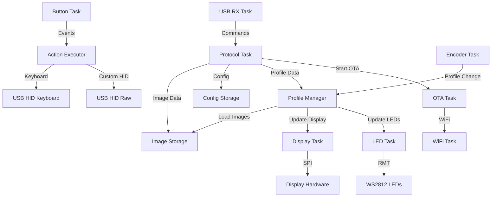

# Архитектура прошивки для ESP32-S3 макроклавиатуры

## Общая архитектура

Прошивка построена на базе ESP-IDF (Espressif IoT Development Framework) и использует FreeRTOS для многозадачности.

### Ключевые характеристики

- **Платформа**: ESP32-S3 N16R8 (16MB Flash, 8MB PSRAM)
- **Framework**: ESP-IDF v5.x
- **RTOS**: FreeRTOS
- **USB**: TinyUSB stack
- **Язык**: C99

## Структура модулей

```
firmware/
├── main/
│   ├── main.c                      # Точка входа, инициализация
│   ├── config.h                    # Конфигурационные константы
│   │
│   ├── hardware/                   # Драйверы аппаратных компонентов
│   │   ├── display_driver.c/h      # Драйвер GC9A01 дисплеев
│   │   ├── display_mux.c/h         # Мультиплексор для выбора дисплея
│   │   ├── button_driver.c/h       # Обработка кнопок с debouncing
│   │   ├── encoder_driver.c/h      # Обработка rotary encoder
│   │   ├── led_driver.c/h          # Управление WS2812 RGB LED
│   │   └── spi_manager.c/h         # Менеджер SPI шины
│   │
│   ├── usb/                        # USB функциональность
│   │   ├── usb_hid_keyboard.c/h    # HID Keyboard интерфейс
│   │   ├── usb_hid_raw.c/h         # HID Raw интерфейс
│   │   ├── usb_cdc.c/h             # CDC UART для логирования
│   │   └── usb_descriptors.c/h     # USB дескрипторы
│   │
│   ├── protocol/                   # Протокол обмена данными
│   │   ├── protocol_handler.c/h    # Обработчик команд протокола
│   │   ├── packet_parser.c/h       # Парсинг пакетов
│   │   ├── image_transfer.c/h      # Передача изображений
│   │   └── command_queue.c/h       # Очередь команд
│   │
│   ├── storage/                    # Работа с памятью
│   │   ├── nvs_manager.c/h         # NVS (Non-Volatile Storage)
│   │   ├── profile_storage.c/h     # Хранение профилей
│   │   ├── image_storage.c/h       # Хранение изображений
│   │   └── config_storage.c/h      # Хранение конфигурации
│   │
│   ├── profile/                    # Управление профилями
│   │   ├── profile_manager.c/h     # Менеджер профилей
│   │   ├── profile_types.h         # Типы данных профилей
│   │   └── action_executor.c/h     # Выполнение действий кнопок
│   │
│   ├── network/                    # Сетевая функциональность
│   │   ├── wifi_manager.c/h        # Управление WiFi (обертка над esp_wifi)
│   │   └── ota_updater.c/h         # OTA обновления (обертка над esp_https_ota)
│   │
│   ├── ui/                         # Пользовательский интерфейс
│   │   ├── display_manager.c/h     # Менеджер отображения
│   │   ├── image_decoder.c/h       # Декодирование JPEG
│   │   └── framebuffer.c/h         # Буфер кадра
│   │
│   └── utils/                      # Утилиты
│       ├── logger.c/h              # Система логирования
│       ├── crc.c/h                 # Расчет контрольных сумм
│       ├── ring_buffer.c/h         # Кольцевой буфер
│       └── task_monitor.c/h        # Мониторинг задач
│
├── components/                     # Внешние компоненты
│   ├── TinyUSB/                    # USB стек
│   ├── lvgl/                       # GUI библиотека (опционально)
│   └── esp-jpeg/                   # JPEG декодер
│
├── CMakeLists.txt
├── sdkconfig                       # Конфигурация ESP-IDF
└── partitions.csv                  # Таблица разделов flash
```

## Детальное описание модулей

### 1. Hardware Layer (Аппаратный уровень)

#### Display Driver ([`display_driver.c/h`](firmware/main/hardware/display_driver.h))
**Назначение**: Управление GC9A01 дисплеями через SPI.

**Функции**:
- Инициализация дисплея (команды настройки GC9A01)
- Отправка данных пикселей (DMA для ускорения)
- Установка окна отрисовки
- Управление яркостью через PWM
- Поворот и зеркалирование изображения

**Особенности**:
- Использование DMA для передачи больших объемов данных
- Двойная буферизация для плавной отрисовки
- Поддержка частичного обновления экрана

#### Display Multiplexer ([`display_mux.c/h`](firmware/main/hardware/display_mux.h))
**Назначение**: Управление схемой мультиплексирования для выбора одного из 10 дисплеев.

**Функции**:
- Выбор активного дисплея (через два шифратора)
- Управление CS линиями
- Синхронизация доступа к SPI шине

**Схема подключения**:
```
4 GPIO -> Два 74HC138 (3-to-8 decoder) -> 10 дисплеев
- 3 бита адреса (A0, A1, A2)
- 1 бит выбора шифратора (SEL):
  * SEL=1 -> первый 74HC138 (дисплеи 0-7)
  * SEL=0 -> второй 74HC138 (дисплеи 8-9, остальные не используются)
```

**Реализация**:
```c
void display_mux_select(uint8_t display_id) {
    if (display_id >= 10) return;
    
    if (display_id < 8) {
        // Первый шифратор (дисплеи 0-7)
        gpio_set_level(PIN_MUX_SEL, 1);
        gpio_set_level(PIN_MUX_A0, (display_id >> 0) & 1);
        gpio_set_level(PIN_MUX_A1, (display_id >> 1) & 1);
        gpio_set_level(PIN_MUX_A2, (display_id >> 2) & 1);
    } else {
        // Второй шифратор (дисплеи 8-9)
        gpio_set_level(PIN_MUX_SEL, 0);
        gpio_set_level(PIN_MUX_A0, (display_id - 8) & 1);
        gpio_set_level(PIN_MUX_A1, 0);
        gpio_set_level(PIN_MUX_A2, 0);
    }
}
```

#### Button Driver ([`button_driver.c/h`](firmware/main/hardware/button_driver.h))
**Назначение**: Обработка нажатий 10 кнопок с debouncing через прерывания.

**Функции**:
- GPIO interrupt на каждую кнопку (только прерывания, без polling)
- Программный debouncing (10-50 мс)
- Определение типа нажатия (short/long press)
- Генерация событий нажатия

**Реализация**:
```c
// GPIO interrupt handler
static void IRAM_ATTR button_isr_handler(void* arg) {
    uint8_t button_id = (uint8_t)(uintptr_t)arg;
    BaseType_t xHigherPriorityTaskWoken = pdFALSE;
    
    button_event_t event = {
        .button_id = button_id,
        .timestamp = esp_timer_get_time(),
        .event_type = BUTTON_EVENT_PRESS,
    };
    
    xQueueSendFromISR(button_event_queue, &event, &xHigherPriorityTaskWoken);
    portYIELD_FROM_ISR(xHigherPriorityTaskWoken);
}

// Инициализация с прерываниями
void button_driver_init(void) {
    for (int i = 0; i < 10; i++) {
        gpio_config_t io_conf = {
            .pin_bit_mask = (1ULL << button_pins[i]),
            .mode = GPIO_MODE_INPUT,
            .pull_up_en = GPIO_PULLUP_ENABLE,
            .pull_down_en = GPIO_PULLDOWN_DISABLE,
            .intr_type = GPIO_INTR_NEGEDGE,  // Прерывание по нажатию
        };
        gpio_config(&io_conf);
        gpio_isr_handler_add(button_pins[i], button_isr_handler, (void*)(uintptr_t)i);
    }
}
```

**Особенности**:
- Только interrupt-driven, polling не используется
- Debouncing в Button Task, не в ISR
- Очередь событий для передачи в основной код

#### Encoder Driver ([`encoder_driver.c/h`](firmware/main/hardware/encoder_driver.h))
**Назначение**: Обработка rotary encoder с кнопкой.

**Функции**:
- Определение направления вращения (CW/CCW)
- Подсчет шагов (с учетом детентов)
- Обработка нажатия кнопки энкодера
- Фильтрация дребезга

**Реализация**:
- Два GPIO для A/B сигналов (с прерываниями)
- Один GPIO для кнопки
- State machine для определения направления

#### LED Driver ([`led_driver.c/h`](firmware/main/hardware/led_driver.h))
**Назначение**: Управление 10 адресными RGB светодиодами WS2812.

**Функции**:
- Установка цвета и яркости для каждого LED
- Эффекты (статичный, дыхание, радуга, волна)
- Синхронизация с профилями
- Индикация состояния устройства

**Реализация**:
- RMT (Remote Control) peripheral для генерации WS2812 сигнала
- Буфер цветов для всех 10 LED
- Неблокирующее обновление

#### SPI Manager ([`spi_manager.c/h`](firmware/main/hardware/spi_manager.h))
**Назначение**: Централизованное управление SPI шиной.

**Функции**:
- Инициализация SPI в режиме master
- Управление доступом к шине (mutex)
- Конфигурация для разных устройств
- DMA транзакции

**Параметры SPI**:
- Частота: 40-80 MHz (для GC9A01)
- Режим: Mode 0 (CPOL=0, CPHA=0)
- Битовый порядок: MSB first

### 2. USB Layer (USB уровень)

#### USB HID Keyboard ([`usb_hid_keyboard.c/h`](firmware/main/usb/usb_hid_keyboard.h))
**Назначение**: Эмуляция USB клавиатуры.

**Функции**:
- Отправка HID keyboard reports
- Эмуляция нажатий клавиш
- Поддержка модификаторов (Ctrl, Shift, Alt, GUI)
- Печать текста (UTF-8 -> HID keycodes)

**Особенности**:
- Стандартный 8-байтовый boot protocol
- Поддержка до 6 одновременных клавиш
- NKRO (N-Key Rollover) опционально

#### USB HID Raw ([`usb_hid_raw.c/h`](firmware/main/usb/usb_hid_raw.h))
**Назначение**: Двунаправленный обмен данными с управляющим софтом.

**Функции**:
- Прием команд от ПК
- Отправка событий и уведомлений
- Обработка custom HID reports
- Буферизация входящих/исходящих данных

**Параметры**:
- Report size: 64 байта
- Endpoints: IN и OUT
- Polling interval: 1 мс

#### USB CDC ([`usb_cdc.c/h`](firmware/main/usb/usb_cdc.h))
**Назначение**: Виртуальный COM порт для логирования.

**Функции**:
- Вывод лог-сообщений
- Настройка уровня логирования
- Буферизация вывода
- Опциональное отключение

#### USB Descriptors ([`usb_descriptors.c/h`](firmware/main/usb/usb_descriptors.h))
**Назначение**: USB дескрипторы устройства.

**Содержит**:
- Device descriptor
- Configuration descriptor
- HID report descriptors (keyboard + raw)
- String descriptors (manufacturer, product, serial)

**Composite USB Device**:
```
USB Device
├── Interface 0: HID Keyboard
├── Interface 1: HID Raw
└── Interface 2: CDC (UART)
```

### 3. Protocol Layer (Протокольный уровень)

#### Protocol Handler ([`protocol_handler.c/h`](firmware/main/protocol/protocol_handler.h))
**Назначение**: Обработка команд протокола.

**Функции**:
- Диспетчеризация команд
- Формирование ответов
- Обработка ошибок
- Управление состоянием

**Архитектура**:
- Command dispatcher (таблица обработчиков)
- State machine для сложных операций
- Асинхронная обработка длительных команд

#### Packet Parser ([`packet_parser.c/h`](firmware/main/protocol/packet_parser.h))
**Назначение**: Парсинг и валидация пакетов.

**Функции**:
- Проверка структуры пакета
- Валидация checksum
- Извлечение payload
- Обработка ошибок формата

#### Image Transfer ([`image_transfer.c/h`](firmware/main/protocol/image_transfer.h))
**Назначение**: Управление передачей изображений.

**Функции**:
- Прием фрагментов изображения
- Сборка полного изображения
- Проверка CRC32
- Сохранение в flash
- Retry механизм

**State Machine**:
```
IDLE -> RECEIVING -> VALIDATING -> SAVING -> COMPLETE
                  -> ERROR (retry or abort)
```

#### Command Queue ([`command_queue.c/h`](firmware/main/protocol/command_queue.h))
**Назначение**: Очередь команд для асинхронной обработки.

**Функции**:
- FIFO очередь команд
- Приоритизация
- Thread-safe операции
- Тайм-ауты

### 4. Storage Layer (Уровень хранения)

#### NVS Manager ([`nvs_manager.c/h`](firmware/main/storage/nvs_manager.h))
**Назначение**: Работа с Non-Volatile Storage (NVS).

**Функции**:
- Инициализация NVS
- Чтение/запись ключ-значение
- Управление namespace
- Обработка ошибок

**Хранимые данные**:
- WiFi credentials
- Текущий профиль
- Настройки устройства
- Калибровочные данные

#### Profile Storage ([`profile_storage.c/h`](firmware/main/storage/profile_storage.h))
**Назначение**: Хранение профилей в flash.

**Функции**:
- Сохранение/загрузка профилей
- Управление версиями
- Проверка целостности (CRC)
- Дефрагментация

#### Image Storage ([`image_storage.c/h`](firmware/main/storage/image_storage.h))
**Назначение**: Хранение изображений для кнопок.

**Функции**:
- Сохранение JPEG изображений
- Индексация (profile_id, button_id)
- Кэширование часто используемых
- Управление свободным местом

#### Config Storage ([`config_storage.c/h`](firmware/main/storage/config_storage.h))
**Назначение**: Хранение конфигурации устройства.

**Функции**:
- Сохранение настроек
- Значения по умолчанию
- Миграция между версиями
- Factory reset

### 5. Profile Layer (Уровень профилей)

#### Profile Manager ([`profile_manager.c/h`](firmware/main/profile/profile_manager.h))
**Назначение**: Управление профилями клавиш.

**Функции**:
- Загрузка/сохранение профилей
- Переключение между профилями
- Валидация профилей
- Кэширование активного профиля

**Структура профиля**:
```c
typedef struct {
    uint8_t profile_id;
    char name[32];
    button_config_t buttons[10];
    led_config_t leds[10];
    uint32_t crc32;
} profile_t;
```

#### Action Executor ([`action_executor.c/h`](firmware/main/profile/action_executor.h))
**Назначение**: Выполнение действий, привязанных к кнопкам.

**Функции**:
- Выполнение keyboard actions
- Выполнение custom HID actions
- Обработка макросов
- Задержки между действиями

**Типы действий**:
- Single key press
- Key combination
- Text typing
- Custom HID report
- Profile switch

### 6. Network Layer (Сетевой уровень)

#### WiFi Manager ([`wifi_manager.c/h`](firmware/main/network/wifi_manager.h))
**Назначение**: Управление WiFi подключением.

**Функции**:
- Подключение к WiFi
- Хранение credentials
- Reconnect логика
- Мониторинг состояния

**Режимы**:
- Station mode (для OTA)
- Опционально: AP mode (для первичной настройки)

#### OTA Updater ([`ota_updater.c/h`](firmware/main/network/ota_updater.h))
**Назначение**: Обертка над ESP-IDF OTA API для упрощения использования.

**Функции**:
- Обертка над `esp_https_ota()` API
- Индикация прогресса через LED и USB
- Интеграция с нашим протоколом команд
- Обработка ошибок

**Использует готовые компоненты ESP-IDF**:
- `esp_https_ota()` - загрузка и установка firmware
- `esp_ota_mark_app_valid_cancel_rollback()` - подтверждение успешного обновления
- Автоматическая проверка MD5
- Автоматический rollback при ошибке

**Процесс OTA** (автоматически в ESP-IDF):
1. Загрузка firmware по HTTPS
2. Проверка подписи и MD5
3. Запись в OTA partition
4. Установка boot partition
5. Перезагрузка
6. Rollback если новая версия не работает

### 7. UI Layer (Уровень интерфейса)

#### Display Manager ([`display_manager.c/h`](firmware/main/ui/display_manager.h))
**Назначение**: Управление отображением на всех дисплеях.

**Функции**:
- Обновление дисплеев
- Кэширование изображений
- Приоритизация обновлений
- Управление очередью обновлений

**Оптимизации**:
- Обновление только измененных дисплеев
- Использование PSRAM для буферов
- Асинхронная отрисовка через DMA

#### Image Decoder ([`image_decoder.c/h`](firmware/main/ui/image_decoder.h))
**Назначение**: Декодирование JPEG изображений.

**Функции**:
- Декодирование JPEG в RGB565
- Использование аппаратного декодера ESP32-S3
- Масштабирование (если нужно)
- Обработка ошибок

#### Framebuffer ([`framebuffer.c/h`](firmware/main/ui/framebuffer.h))
**Назначение**: Буфер кадра для дисплеев.

**Функции**:
- Выделение буферов в PSRAM
- Управление памятью
- Копирование и преобразование данных
- Оптимизация доступа

### 8. Utils Layer (Утилиты)

#### Logger ([`logger.c/h`](firmware/main/utils/logger.h))
**Назначение**: Система логирования.

**Функции**:
- Форматированный вывод логов
- Уровни логирования
- Вывод в USB CDC
- Опциональное сохранение в flash

**Макросы**:
```c
LOG_ERROR(tag, format, ...)
LOG_WARN(tag, format, ...)
LOG_INFO(tag, format, ...)
LOG_DEBUG(tag, format, ...)
```

#### CRC ([`crc.c/h`](firmware/main/utils/crc.h))
**Назначение**: Расчет контрольных сумм.

**Функции**:
- CRC32 (для изображений и профилей)
- XOR checksum (для пакетов)
- Инкрементальный расчет

#### Ring Buffer ([`ring_buffer.c/h`](firmware/main/utils/ring_buffer.h))
**Назначение**: Кольцевой буфер для данных.

**Функции**:
- Thread-safe операции
- Переменный размер элементов
- Блокирующее/неблокирующее чтение

#### Task Monitor ([`task_monitor.c/h`](firmware/main/utils/task_monitor.h))
**Назначение**: Мониторинг FreeRTOS задач.

**Функции**:
- Отслеживание использования CPU
- Мониторинг stack usage
- Обнаружение deadlock
- Статистика задач

## FreeRTOS задачи

### Основные задачи

```c
// Приоритеты задач (0 = lowest, 25 = highest)
#define TASK_PRIORITY_USB_RX        20  // Прием USB данных
#define TASK_PRIORITY_BUTTON        18  // Обработка кнопок
#define TASK_PRIORITY_ENCODER       18  // Обработка энкодера
#define TASK_PRIORITY_PROTOCOL      15  // Обработка протокола
#define TASK_PRIORITY_DISPLAY       12  // Обновление дисплеев
#define TASK_PRIORITY_LED           10  // Обновление LED
#define TASK_PRIORITY_WIFI          8   // WiFi операции
#define TASK_PRIORITY_OTA           5   // OTA обновление
#define TASK_PRIORITY_MONITOR       3   // Мониторинг системы
```

### 1. USB RX Task
**Назначение**: Прием данных от USB HID Raw.

**Функции**:
- Чтение HID reports
- Передача в protocol handler
- Обработка ошибок

**Stack size**: 4096 bytes

### 2. Button Task
**Назначение**: Обработка нажатий кнопок.

**Функции**:
- Опрос состояния кнопок
- Debouncing
- Генерация событий
- Выполнение действий

**Stack size**: 3072 bytes

### 3. Encoder Task
**Назначение**: Обработка rotary encoder.

**Функции**:
- Определение вращения
- Переключение профилей
- Обработка кнопки энкодера

**Stack size**: 2048 bytes

### 4. Protocol Task
**Назначение**: Обработка команд протокола.

**Функции**:
- Парсинг команд
- Выполнение команд
- Формирование ответов

**Stack size**: 8192 bytes (для image transfer)

### 5. Display Task
**Назначение**: Обновление дисплеев.

**Функции**:
- Отрисовка изображений
- Обновление измененных дисплеев
- Анимации

**Stack size**: 4096 bytes

### 6. LED Task
**Назначение**: Управление RGB LED.

**Функции**:
- Обновление цветов
- Эффекты
- Синхронизация с профилем

**Stack size**: 2048 bytes

### 7. WiFi Task
**Назначение**: Управление WiFi (запускается по требованию).

**Функции**:
- Подключение к WiFi
- Поддержание соединения
- Обработка событий

**Stack size**: 4096 bytes

### 8. OTA Task
**Назначение**: OTA обновление (запускается по команде).

**Функции**:
- Загрузка firmware
- Проверка и установка
- Индикация прогресса

**Stack size**: 8192 bytes

## Межзадачное взаимодействие

### Очереди (Queues)

```c
// Очередь событий кнопок
QueueHandle_t button_event_queue;  // 10 элементов

// Очередь команд протокола
QueueHandle_t protocol_cmd_queue;  // 5 элементов

// Очередь событий энкодера
QueueHandle_t encoder_event_queue; // 5 элементов

// Очередь обновлений дисплея
QueueHandle_t display_update_queue; // 10 элементов
```

### Семафоры и мьютексы

```c
// Мьютекс для SPI шины
SemaphoreHandle_t spi_mutex;

// Мьютекс для flash операций
SemaphoreHandle_t flash_mutex;

// Семафор для USB TX готовности
SemaphoreHandle_t usb_tx_ready;

// Мьютекс для профиля
SemaphoreHandle_t profile_mutex;
```

### Event Groups

```c
// Группа событий системы
EventGroupHandle_t system_events;

#define EVENT_WIFI_CONNECTED    (1 << 0)
#define EVENT_OTA_IN_PROGRESS   (1 << 1)
#define EVENT_USB_CONFIGURED    (1 << 2)
#define EVENT_PROFILE_CHANGED   (1 << 3)
```

## Диаграмма взаимодействия задач



## Управление памятью

### Flash Memory Layout (16 MB)

```
0x000000 - 0x00FFFF  : Bootloader (64 KB)
0x010000 - 0x010FFF  : Partition Table (4 KB)
0x011000 - 0x011FFF  : NVS (4 KB)
0x012000 - 0x012FFF  : OTA Data (4 KB)
0x013000 - 0x013FFF  : PHY Init (4 KB)

0x020000 - 0x31FFFF  : App0 (OTA_0) (3 MB)
0x320000 - 0x61FFFF  : App1 (OTA_1) (3 MB)

0x620000 - 0xFFFFFF  : Storage (10 MB)
  ├── Profile Storage (2 MB)
  ├── Image Storage (7 MB)
  └── Reserved (1 MB)
```

### RAM Usage

**SRAM (512 KB)**:
- FreeRTOS kernel: ~50 KB
- Task stacks: ~40 KB
- Heap: ~200 KB
- Static data: ~50 KB
- USB buffers: ~20 KB
- Reserved: ~150 KB

**PSRAM (8 MB)**:
- Display framebuffers: 10 × 51.2 KB = 512 KB
- Image decode buffer: 512 KB
- Image cache: 2 MB
- Free: ~5 MB

## Конфигурация ESP-IDF

### Ключевые параметры sdkconfig

```ini
# USB Configuration
CONFIG_TINYUSB_ENABLED=y
CONFIG_TINYUSB_HID_ENABLED=y
CONFIG_TINYUSB_CDC_ENABLED=y

# PSRAM
CONFIG_SPIRAM=y
CONFIG_SPIRAM_MODE_OCT=y
CONFIG_SPIRAM_SPEED_80M=y

# Flash
CONFIG_ESPTOOLPY_FLASHSIZE_16MB=y
CONFIG_ESPTOOLPY_FLASHFREQ_80M=y

# FreeRTOS
CONFIG_FREERTOS_HZ=1000
CONFIG_FREERTOS_UNICORE=n

# WiFi
CONFIG_ESP32_WIFI_STATIC_RX_BUFFER_NUM=10
CONFIG_ESP32_WIFI_DYNAMIC_RX_BUFFER_NUM=32

# Logging
CONFIG_LOG_DEFAULT_LEVEL_INFO=y
CONFIG_LOG_MAXIMUM_LEVEL_VERBOSE=y

# Compiler
CONFIG_COMPILER_OPTIMIZATION_PERF=y
```

## Производительность и оптимизация

### Критические пути

1. **Button Press → Action**: < 10 мс
   - Button interrupt → Event queue → Action executor → USB HID

2. **Profile Switch**: < 100 мс
   - Encoder event → Profile manager → Load images → Update displays

3. **Display Update**: < 50 мс
   - Image decode → Framebuffer → SPI transfer

### Оптимизации

1. **DMA для SPI**: Освобождает CPU во время передачи данных
2. **PSRAM для буферов**: Экономит SRAM для критических данных
3. **Кэширование изображений**: Уменьшает обращения к flash
4. **Приоритеты задач**: Гарантирует отклик на пользовательский ввод
5. **Аппаратный JPEG декодер**: Ускоряет декодирование в 10+ раз

### Энергопотребление

- **Активный режим**: ~200-300 мА @ 5V
  - ESP32-S3: ~100 мА
  - Дисплеи: ~100 мА (10 × 10 мА)
  - LED: ~50 мА (зависит от яркости)
  
- **Idle режим**: ~150 мА @ 5V
  - Дисплеи в standby
  - LED выключены
  - WiFi выключен

## Обработка ошибок

### Стратегии восстановления

1. **USB disconnect**: Сохранить состояние, ждать переподключения
2. **Flash error**: Retry → Fallback to default → Error report
3. **Display error**: Skip display → Continue with others → Log error
4. **Memory allocation fail**: Free caches → Retry → Graceful degradation
5. **WiFi error**: Retry with backoff → Disable WiFi → Continue offline

### Watchdog

```c
// Task watchdog (10 секунд)
esp_task_wdt_init(10, true);

// Добавить критические задачи
esp_task_wdt_add(button_task_handle);
esp_task_wdt_add(protocol_task_handle);
```

### Panic Handler

При критической ошибке:
1. Сохранить лог в flash
2. Индикация на LED (красный мигающий)
3. Вывод в USB CDC
4. Перезагрузка через 5 секунд
