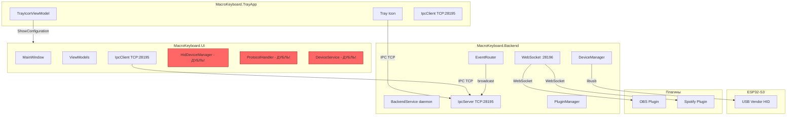
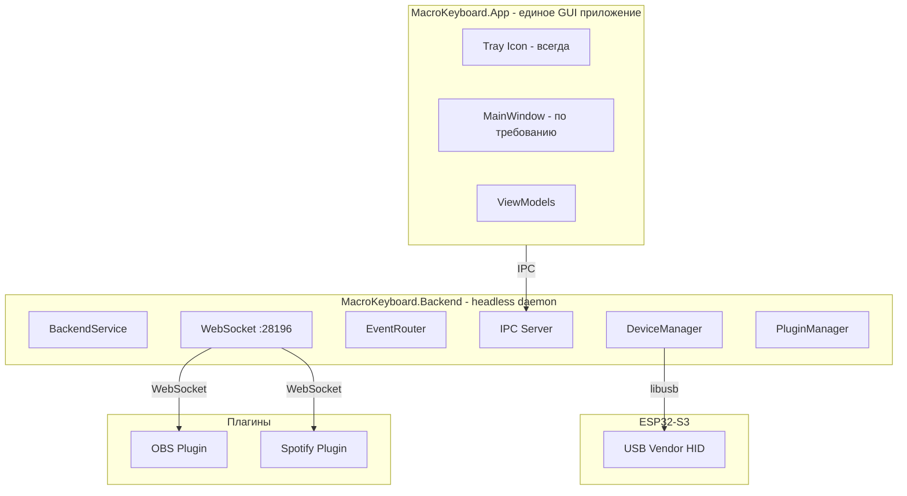

# Архитектурный анализ: 3 приложения vs 1 приложение

## Текущая архитектура — три процесса

---

## Обнаруженные проблемы текущей архитектуры

### 1. Дублирование USB-стека в UI

Критическая находка: `MacroKeyboard.UI/App.axaml.cs` регистрирует **собственный** `HidDeviceManager`, `ProtocolHandler`, `DeviceService` — полный USB-стек, идентичный Backend. Это значит:

- UI может пытаться захватить USB-устройство параллельно с Backend
- Два процесса не могут одновременно владеть одним USB Vendor интерфейсом через libusb
- Непонятно, через что реально работает UI — через IPC к Backend или напрямую через USB

### 2. IPC — самописный TCP-протокол

- `IpcServer` / `IpcClient` — ручная реализация на `TcpListener` / `TcpClient`
- JSON-сообщения разделяются `\n` — хрупкий протокол
- `IpcMessage.Data` имеет тип `object?` — десериализация в `JObject` вместо типизированных объектов
- Нет retry/reconnect логики в клиенте
- Нет аутентификации, нет версионирования протокола

### 3. TrayApp — минимальная функциональность

`TrayApp` делает ровно три вещи:
- Показывает иконку в трее
- Отображает статус устройства через IPC
- Запускает `MacroKeyboard.UI.exe` как отдельный процесс

Это ~260 строк кода ViewModel + ~70 строк App.axaml.cs.

---

## Анализ: зачем обычно разделяют на процессы

| Причина разделения | Применимо к нашему проекту? |
|---|---|
| **Backend как системный сервис** — работает без GUI, стартует при загрузке ОС | ✅ Да — устройство должно работать без открытого окна |
| **Плагины через WebSocket** — внешние процессы подключаются к API | ✅ Да — Stream Deck совместимость требует WebSocket сервер |
| **UI открывается по требованию** — тяжёлое окно не висит в памяти постоянно | ✅ Да — конфигуратор нужен редко |
| **Изоляция сбоев** — падение UI не роняет обработку кнопок | ✅ Да — важно для устройства ввода |
| **TrayApp отдельно от Backend** — ... | ❌ Нет обоснования |

---

## Вердикт: 3 приложения — избыточно, но 1 — недостаточно

### Рекомендация: **2 приложения** вместо 3

### Почему Backend должен остаться отдельным процессом

1. **Устройство должно работать без GUI** — кнопки, энкодер, LED должны функционировать даже когда конфигуратор закрыт. Пользователь нажимает кнопку → Backend выполняет макрос. Это основной use case.

2. **Системный сервис** — Backend регистрируется как Windows Service / systemd daemon. Он стартует при загрузке ОС. GUI-приложение так не работает.

3. **Плагины** — WebSocket сервер для Stream Deck плагинов должен быть доступен постоянно, независимо от состояния UI.

4. **Изоляция** — если UI упадёт с необработанным исключением, устройство продолжит работать.

5. **USB эксклюзивный доступ** — libusb claim interface даёт эксклюзивный доступ одному процессу. Два процесса не могут одновременно общаться с устройством.

### Почему TrayApp нужно объединить с UI

1. **TrayApp не делает ничего, что не может делать UI** — показ иконки в трее, отображение статуса, запуск окна конфигурации. Avalonia прекрасно поддерживает tray icon.

2. **Устранение лишнего процесса** — вместо TrayApp, запускающего UI как отдельный процесс, одно приложение стартует в трее и показывает/скрывает окно по двойному клику.

3. **Упрощение деплоя** — два exe вместо трёх, меньше путаницы для пользователя.

4. **Паттерн индустрии** — Logitech G HUB, Corsair iCUE, Razer Synapse — все работают как одно GUI-приложение с иконкой в трее + отдельный сервис.

### Почему нельзя всё в одном процессе

1. **GUI-приложение нельзя зарегистрировать как Windows Service / systemd daemon** — это фундаментальное ограничение. Сервис не имеет GUI-сессии.

2. **Пользователь закрывает окно = устройство перестаёт работать** — неприемлемо для устройства ввода.

3. **Плагины теряют связь при закрытии UI** — WebSocket сервер умирает вместе с процессом.

4. **Потребление ресурсов** — Avalonia UI framework + все view models в памяти постоянно, даже когда окно не нужно.

---

## План действий при объединении TrayApp + UI

### Что нужно сделать

1. **Перенести tray-функциональность в MacroKeyboard.UI**
   - Добавить `NativeMenu` / tray icon в `App.axaml.cs`
   - При старте — показывать только tray icon, окно скрыто
   - По двойному клику — показать `MainWindow`
   - По закрытию окна — скрыть в трей, не завершать процесс

2. **Убрать дублирование USB-стека из UI**
   - Удалить регистрацию `HidDeviceManager`, `ProtocolHandler`, `DeviceService` из `MacroKeyboard.UI/App.axaml.cs`
   - Все команды к устройству — только через IPC к Backend
   - UI становится чистым IPC-клиентом

3. **Удалить проект MacroKeyboard.TrayApp**
   - Перенести полезную логику из `TrayIconViewModel` в UI
   - Удалить `.csproj`, убрать из `.sln`

4. **Улучшить IPC**
   - Добавить auto-reconnect в `IpcClient`
   - Типизировать `IpcMessage.Data` вместо `object?`

---

## Сравнительная таблица

| Критерий | 3 приложения - сейчас | 2 приложения - рекомендация | 1 приложение |
|---|---|---|---|
| Устройство работает без GUI | ✅ | ✅ | ❌ |
| Автозапуск как сервис | ✅ | ✅ | ❌ |
| Плагины всегда доступны | ✅ | ✅ | ❌ |
| Изоляция сбоев UI | ✅ | ✅ | ❌ |
| Простота архитектуры | ❌ | ✅ | ✅ |
| Нет дублирования кода | ❌ | ✅ | ✅ |
| Простота деплоя | ❌ | ✅ | ✅ |
| Количество IPC-связей | 2 клиента | 1 клиент | 0 |
| Соответствие индустрии | ❌ | ✅ | ❌ |
