# Docker Integration - Диаграммы

## Архитектура Docker решения

### Общая схема

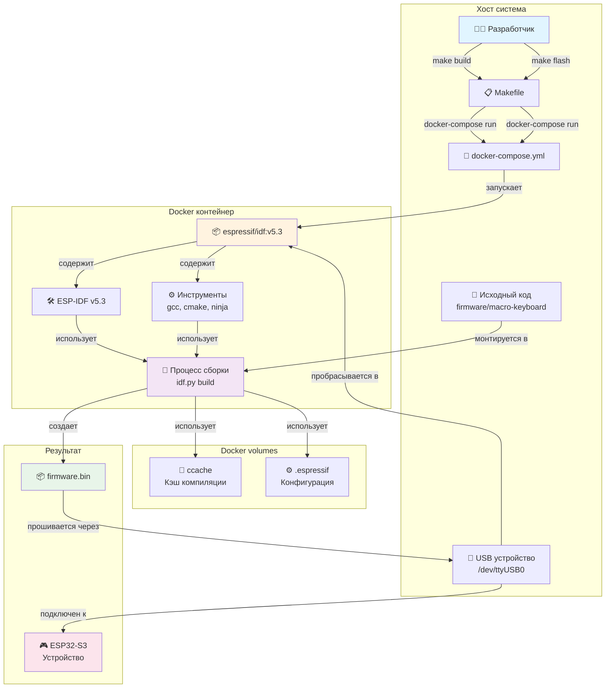

## Workflow разработки

### Цикл разработки с Docker

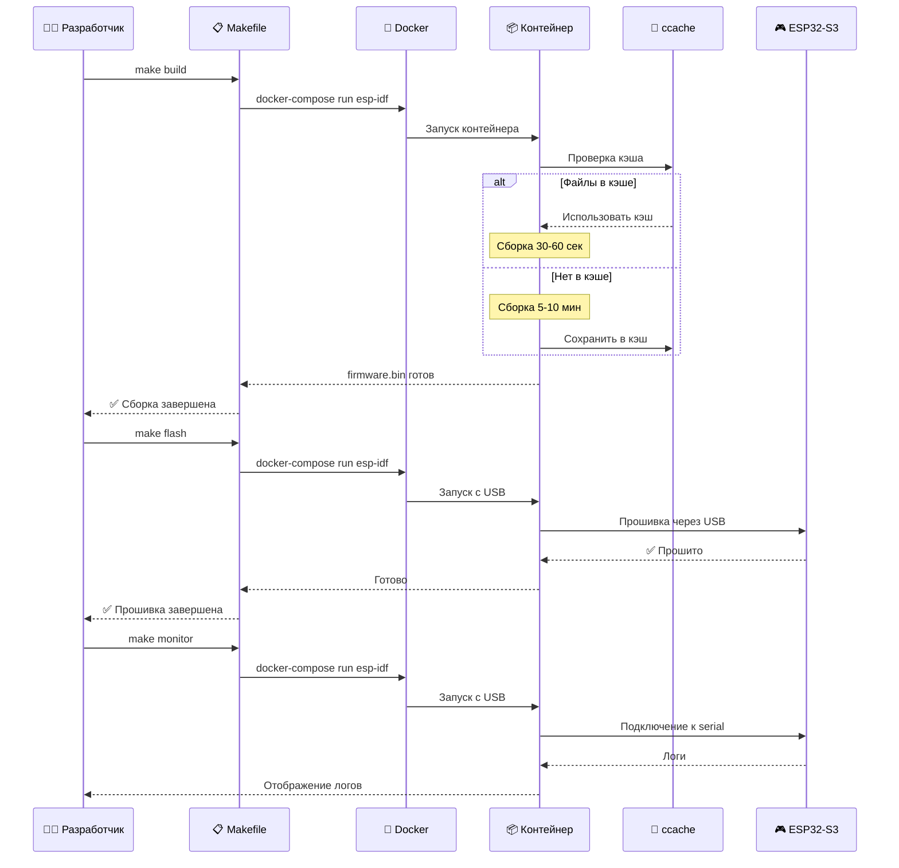

## Сравнение подходов

### Локальная установка vs Docker

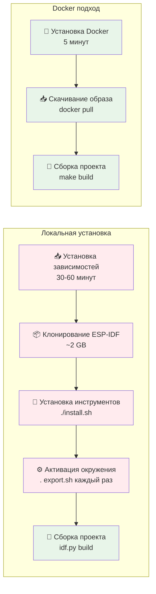

### Время настройки

```mermaid
gantt
    title Время настройки окружения
    dateFormat X
    axisFormat %M мин
    
    section Локальная установка
    Установка зависимостей :a1, 0, 15
    Клонирование ESP-IDF :a2, after a1, 10
    Установка инструментов :a3, after a2, 20
    Настройка окружения :a4, after a3, 5
    Первая сборка :a5, after a4, 10
    
    section Docker
    Установка Docker :b1, 0, 5
    Скачивание образа :b2, after b1, 5
    Первая сборка :b3, after b2, 10
```

## Структура volumes

### Docker volumes для кэширования

```mermaid
graph TB
    subgraph "Хост система"
        HOST[💻 Хост]
    end
    
    subgraph "Docker volumes"
        CCACHE[💾 elgato-ccache<br/>Кэш компиляции<br/>~2 GB]
        CONFIG[⚙️ elgato-esp-config<br/>Инструменты ESP-IDF<br/>~500 MB]
    end
    
    subgraph "Контейнер 1"
        C1[📦 Сборка проекта]
        C1_CCACHE[/root/.ccache]
        C1_CONFIG[/root/.espressif]
    end
    
    subgraph "Контейнер 2"
        C2[📦 Прошивка устройства]
        C2_CCACHE[/root/.ccache]
        C2_CONFIG[/root/.espressif]
    end
    
    HOST -->|создает| CCACHE
    HOST -->|создает| CONFIG
    
    CCACHE -->|монтируется в| C1_CCACHE
    CONFIG -->|монтируется в| C1_CONFIG
    
    CCACHE -->|монтируется в| C2_CCACHE
    CONFIG -->|монтируется в| C2_CONFIG
    
    C1_CCACHE -->|сохраняет| CCACHE
    C2_CCACHE -->|использует| CCACHE
    
    style CCACHE fill:#e3f2fd
    style CONFIG fill:#f3e5f5
    style C1 fill:#fff3e0
    style C2 fill:#fff3e0
```

## Производительность сборки

### Влияние ccache на время сборки

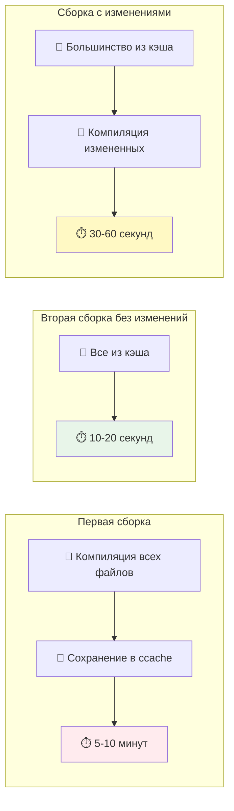

## CI/CD интеграция

### GitHub Actions workflow

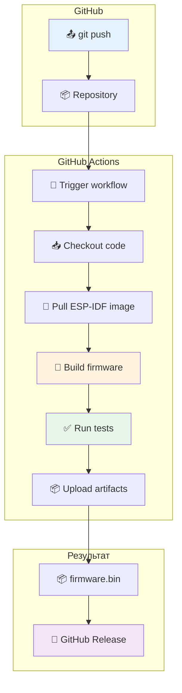

### Пример GitHub Actions workflow

```yaml
name: Build Firmware

on: [push, pull_request]

jobs:
  build:
    runs-on: ubuntu-latest
    
    steps:
      - name: Checkout code
        uses: actions/checkout@v3
      
      - name: Build firmware
        run: |
          cd firmware
          docker-compose run --rm esp-idf idf.py build
      
      - name: Upload artifacts
        uses: actions/upload-artifact@v3
        with:
          name: firmware
          path: firmware/macro-keyboard/build/*.bin
```

## Отладка в Docker

### Подключение GDB через Docker

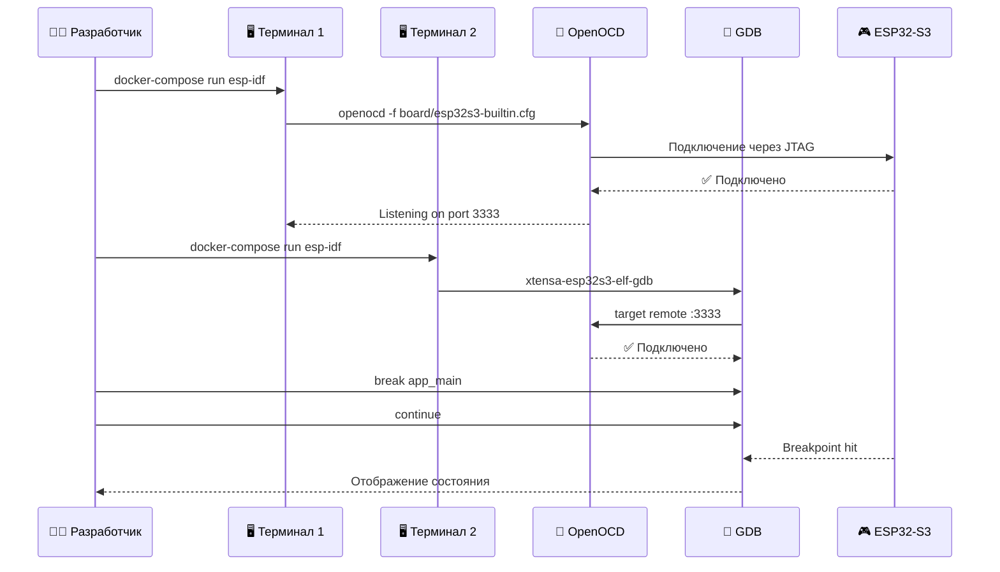

## VS Code Dev Container

### Интеграция с VS Code

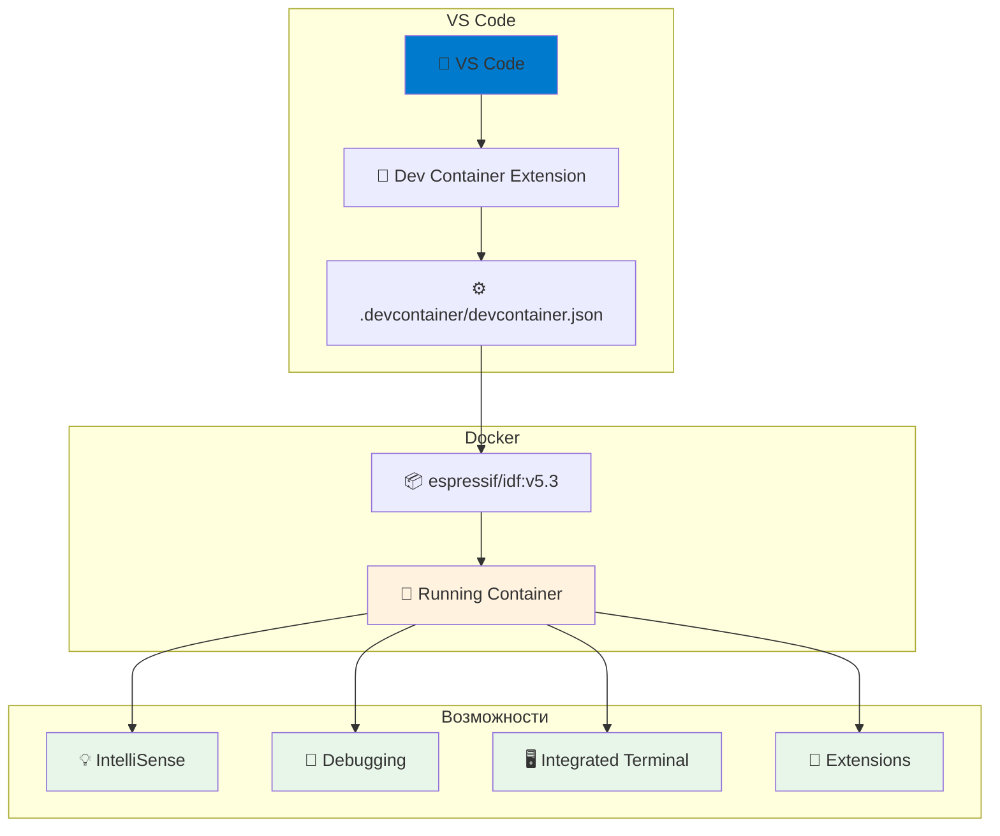

## Использование ресурсов

### Сравнение использования диска

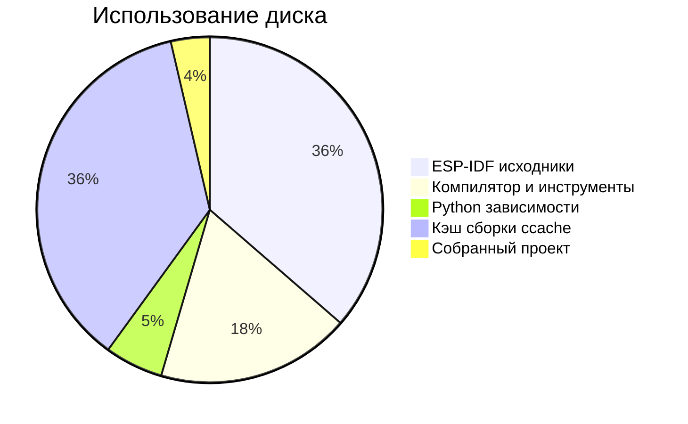

### Использование памяти при сборке

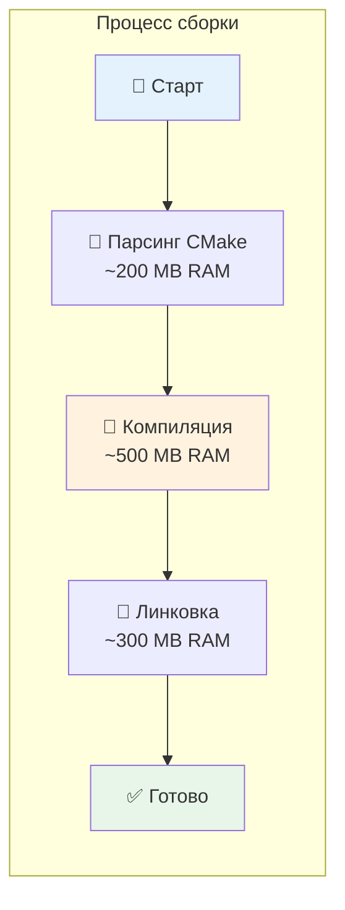

## Рекомендуемая конфигурация

### Минимальные требования

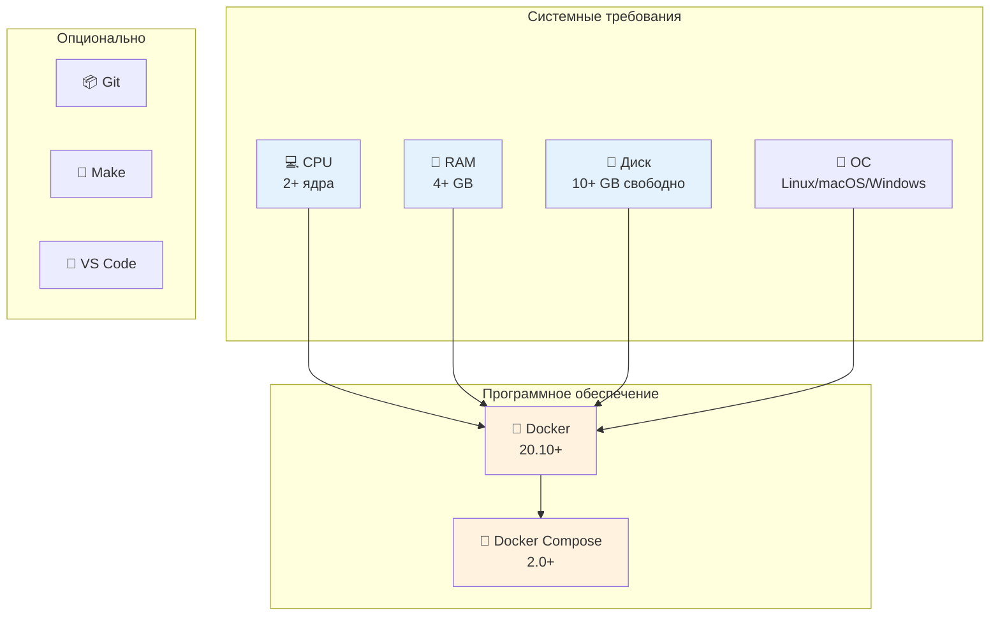

## Troubleshooting Flow

### Решение проблем с USB

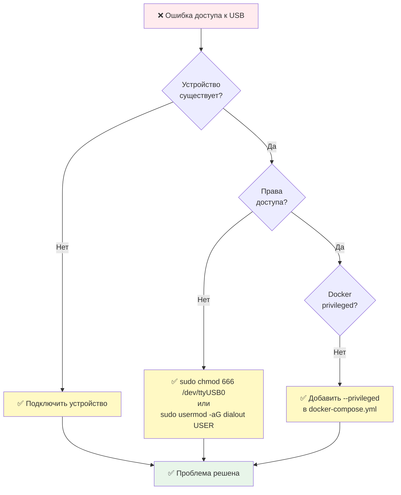

## Итоговое сравнение

### Преимущества и недостатки

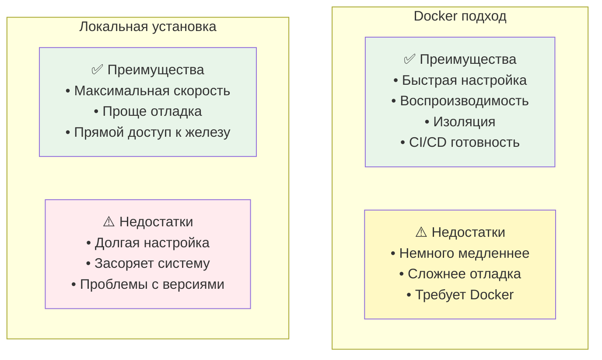

---

**Версия документа**: 1.0  
**Дата**: 2026-03-25  
**Статус**: Готов к использованию
