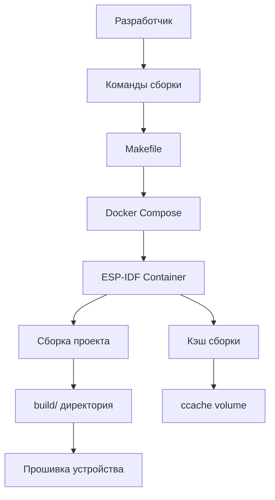

# Интеграция Docker для сборки ESP-IDF проекта

## Обзор

Использование Docker для сборки ESP-IDF проектов обеспечивает:
- ✅ **Воспроизводимость** - одинаковое окружение на всех машинах
- ✅ **Простота настройки** - не нужно устанавливать ESP-IDF локально
- ✅ **Изоляция** - не засоряет систему зависимостями
- ✅ **CI/CD готовность** - легко интегрировать в pipeline
- ✅ **Версионирование** - можно зафиксировать версию ESP-IDF

## Официальные Docker образы Espressif

Espressif предоставляет официальные образы на Docker Hub:

### Доступные образы

```bash
# Последняя версия ESP-IDF v5.x
espressif/idf:latest

# Конкретная версия ESP-IDF v5.3
espressif/idf:v5.3

# Версия с конкретным релизом
espressif/idf:release-v5.3

# Версия только для ESP32-S3 (меньший размер)
espressif/idf:v5.3-esp32s3
```

### Что включено в образ

- ✅ ESP-IDF framework (полная установка)
- ✅ Компилятор xtensa-esp32s3-elf-gcc
- ✅ Все необходимые инструменты (cmake, ninja, ccache)
- ✅ Python с установленными зависимостями
- ✅ OpenOCD для отладки
- ✅ Все системные библиотеки

### Размер образов

- `espressif/idf:v5.3` - ~2.5 GB (все платформы)
- `espressif/idf:v5.3-esp32s3` - ~1.8 GB (только ESP32-S3)

## Архитектура решения



## Структура файлов

```
firmware/
├── Dockerfile              # Кастомный образ (опционально)
├── docker-compose.yml      # Конфигурация Docker Compose
├── .dockerignore          # Исключения для Docker
├── Makefile               # Упрощенные команды
├── scripts/
│   ├── docker-build.sh    # Скрипт сборки
│   ├── docker-flash.sh    # Скрипт прошивки
│   ├── docker-monitor.sh  # Скрипт мониторинга
│   └── docker-menuconfig.sh # Скрипт конфигурации
└── macro-keyboard/        # Исходный код проекта
```

## Конфигурационные файлы

### 1. docker-compose.yml

```yaml
version: '3.8'

services:
  esp-idf:
    image: espressif/idf:v5.3
    container_name: elgato-esp-idf
    working_dir: /project
    volumes:
      # Монтируем исходный код
      - ./macro-keyboard:/project:cached
      # Кэш для ускорения сборки
      - esp-idf-ccache:/root/.ccache
      # Конфигурация ESP-IDF
      - esp-idf-config:/root/.espressif
    environment:
      # Настройки ccache
      - CCACHE_DIR=/root/.ccache
      - CCACHE_MAXSIZE=2G
      # Настройки IDF
      - IDF_TARGET=esp32s3
    devices:
      # Доступ к USB устройствам для прошивки
      - /dev/ttyUSB0:/dev/ttyUSB0
      - /dev/ttyACM0:/dev/ttyACM0
    privileged: true
    stdin_open: true
    tty: true
    command: /bin/bash

volumes:
  esp-idf-ccache:
    name: elgato-ccache
  esp-idf-config:
    name: elgato-esp-config
```

### 2. Dockerfile (опционально, для кастомизации)

```dockerfile
# Базовый образ от Espressif
FROM espressif/idf:v5.3

# Метаданные
LABEL maintainer="your-email@example.com"
LABEL description="ESP-IDF build environment for Elgato Macro Keyboard"
LABEL version="1.0"

# Установка дополнительных инструментов (если нужно)
RUN apt-get update && apt-get install -y \
    vim \
    htop \
    && rm -rf /var/lib/apt/lists/*

# Настройка ccache
RUN ccache --max-size=2G

# Создание рабочей директории
WORKDIR /project

# Копирование скриптов (опционально)
COPY scripts/*.sh /usr/local/bin/
RUN chmod +x /usr/local/bin/*.sh

# Установка переменных окружения
ENV IDF_TARGET=esp32s3
ENV CCACHE_DIR=/root/.ccache

# Точка входа
ENTRYPOINT ["/bin/bash"]
```

### 3. .dockerignore

```
# Build artifacts
build/
sdkconfig.old
*.pyc
__pycache__/

# IDE files
.vscode/
.idea/
*.swp
*.swo

# Git
.git/
.gitignore

# Documentation
*.md
docs/

# Logs
*.log

# OS files
.DS_Store
Thumbs.db
```

### 4. Makefile

```makefile
# Makefile для упрощения работы с Docker

.PHONY: help build flash monitor menuconfig clean shell

# Переменные
PROJECT_DIR := macro-keyboard
DOCKER_COMPOSE := docker-compose
PORT ?= /dev/ttyUSB0

help: ## Показать справку
	@echo "Доступные команды:"
	@echo "  make build       - Собрать проект"
	@echo "  make flash       - Прошить устройство"
	@echo "  make monitor     - Открыть serial monitor"
	@echo "  make menuconfig  - Открыть menuconfig"
	@echo "  make clean       - Очистить сборку"
	@echo "  make fullclean   - Полная очистка"
	@echo "  make shell       - Открыть shell в контейнере"
	@echo "  make size        - Показать размер прошивки"
	@echo ""
	@echo "Переменные:"
	@echo "  PORT=/dev/ttyUSB0  - Порт устройства"

build: ## Собрать проект
	@echo "🔨 Сборка проекта..."
	$(DOCKER_COMPOSE) run --rm esp-idf idf.py build

flash: ## Прошить устройство
	@echo "📤 Прошивка устройства на $(PORT)..."
	$(DOCKER_COMPOSE) run --rm esp-idf idf.py -p $(PORT) flash

monitor: ## Открыть serial monitor
	@echo "📺 Открытие serial monitor на $(PORT)..."
	$(DOCKER_COMPOSE) run --rm esp-idf idf.py -p $(PORT) monitor

flash-monitor: ## Прошить и открыть monitor
	@echo "📤📺 Прошивка и мониторинг..."
	$(DOCKER_COMPOSE) run --rm esp-idf idf.py -p $(PORT) flash monitor

menuconfig: ## Открыть menuconfig
	@echo "⚙️  Открытие menuconfig..."
	$(DOCKER_COMPOSE) run --rm esp-idf idf.py menuconfig

clean: ## Очистить сборку
	@echo "🧹 Очистка сборки..."
	$(DOCKER_COMPOSE) run --rm esp-idf idf.py fullclean

fullclean: clean ## Полная очистка включая кэш
	@echo "🧹 Полная очистка..."
	docker volume rm elgato-ccache elgato-esp-config 2>/dev/null || true

shell: ## Открыть shell в контейнере
	@echo "🐚 Открытие shell..."
	$(DOCKER_COMPOSE) run --rm esp-idf /bin/bash

size: ## Показать размер прошивки
	@echo "📊 Размер прошивки:"
	$(DOCKER_COMPOSE) run --rm esp-idf idf.py size

size-components: ## Показать размер компонентов
	@echo "📊 Размер компонентов:"
	$(DOCKER_COMPOSE) run --rm esp-idf idf.py size-components

size-files: ## Показать размер файлов
	@echo "📊 Размер файлов:"
	$(DOCKER_COMPOSE) run --rm esp-idf idf.py size-files

erase-flash: ## Стереть flash
	@echo "🗑️  Стирание flash..."
	$(DOCKER_COMPOSE) run --rm esp-idf idf.py -p $(PORT) erase-flash

app-flash: ## Прошить только приложение (быстрее)
	@echo "📤 Прошивка приложения..."
	$(DOCKER_COMPOSE) run --rm esp-idf idf.py -p $(PORT) app-flash

partition-table: ## Показать partition table
	@echo "📋 Partition table:"
	$(DOCKER_COMPOSE) run --rm esp-idf idf.py partition-table

# Дополнительные команды

create-project: ## Создать новый проект из шаблона
	@echo "📁 Создание проекта..."
	$(DOCKER_COMPOSE) run --rm esp-idf idf.py create-project $(PROJECT_DIR)

pull: ## Обновить Docker образ
	@echo "⬇️  Обновление Docker образа..."
	docker pull espressif/idf:v5.3

logs: ## Показать логи контейнера
	$(DOCKER_COMPOSE) logs -f

ps: ## Показать запущенные контейнеры
	$(DOCKER_COMPOSE) ps

down: ## Остановить контейнеры
	$(DOCKER_COMPOSE) down

# Информация о системе
info: ## Показать информацию о системе
	@echo "ℹ️  Информация о системе:"
	@echo ""
	@echo "Docker версия:"
	@docker --version
	@echo ""
	@echo "Docker Compose версия:"
	@docker-compose --version
	@echo ""
	@echo "ESP-IDF версия:"
	@$(DOCKER_COMPOSE) run --rm esp-idf idf.py --version
	@echo ""
	@echo "Доступные USB устройства:"
	@ls -la /dev/ttyUSB* /dev/ttyACM* 2>/dev/null || echo "Нет USB устройств"
```

## Скрипты для автоматизации

### scripts/docker-build.sh

```bash
#!/bin/bash
set -e

echo "🔨 Сборка проекта в Docker..."

# Проверка наличия docker-compose
if ! command -v docker-compose &> /dev/null; then
    echo "❌ docker-compose не установлен"
    exit 1
fi

# Переход в директорию firmware
cd "$(dirname "$0")/.."

# Запуск сборки
docker-compose run --rm esp-idf idf.py build

echo "✅ Сборка завершена успешно!"
```

### scripts/docker-flash.sh

```bash
#!/bin/bash
set -e

# Порт по умолчанию
PORT=${1:-/dev/ttyUSB0}

echo "📤 Прошивка устройства через Docker..."
echo "Порт: $PORT"

# Проверка наличия порта
if [ ! -e "$PORT" ]; then
    echo "❌ Устройство не найдено на $PORT"
    echo "Доступные устройства:"
    ls -la /dev/ttyUSB* /dev/ttyACM* 2>/dev/null || echo "Нет USB устройств"
    exit 1
fi

# Переход в директорию firmware
cd "$(dirname "$0")/.."

# Прошивка
docker-compose run --rm esp-idf idf.py -p "$PORT" flash

echo "✅ Прошивка завершена успешно!"
```

### scripts/docker-monitor.sh

```bash
#!/bin/bash
set -e

# Порт по умолчанию
PORT=${1:-/dev/ttyUSB0}

echo "📺 Открытие serial monitor через Docker..."
echo "Порт: $PORT"
echo "Для выхода нажмите Ctrl+]"
echo ""

# Переход в директорию firmware
cd "$(dirname "$0")/.."

# Мониторинг
docker-compose run --rm esp-idf idf.py -p "$PORT" monitor
```

### scripts/docker-menuconfig.sh

```bash
#!/bin/bash
set -e

echo "⚙️  Открытие menuconfig через Docker..."

# Переход в директорию firmware
cd "$(dirname "$0")/.."

# Menuconfig
docker-compose run --rm esp-idf idf.py menuconfig

echo "✅ Конфигурация сохранена"
```

## Использование

### Первоначальная настройка

```bash
# 1. Установить Docker и Docker Compose (если еще не установлены)
sudo apt-get update
sudo apt-get install -y docker.io docker-compose

# 2. Добавить пользователя в группу docker
sudo usermod -aG docker $USER
newgrp docker

# 3. Скачать Docker образ ESP-IDF
cd firmware
docker pull espressif/idf:v5.3

# 4. Создать структуру проекта (если еще не создана)
docker-compose run --rm esp-idf idf.py create-project macro-keyboard
```

### Ежедневная работа

```bash
cd firmware

# Сборка проекта
make build

# Прошивка устройства
make flash PORT=/dev/ttyUSB0

# Прошивка и мониторинг
make flash-monitor PORT=/dev/ttyUSB0

# Только мониторинг
make monitor PORT=/dev/ttyUSB0

# Конфигурация проекта
make menuconfig

# Очистка сборки
make clean

# Показать размер прошивки
make size
```

### Работа без Makefile

```bash
cd firmware

# Сборка
docker-compose run --rm esp-idf idf.py build

# Прошивка
docker-compose run --rm esp-idf idf.py -p /dev/ttyUSB0 flash

# Мониторинг
docker-compose run --rm esp-idf idf.py -p /dev/ttyUSB0 monitor

# Menuconfig
docker-compose run --rm esp-idf idf.py menuconfig

# Shell в контейнере
docker-compose run --rm esp-idf /bin/bash
```

## Преимущества Docker подхода

### 1. Простота настройки

**Без Docker:**
```bash
# Нужно установить множество зависимостей
sudo apt-get install git wget flex bison gperf python3 python3-pip \
    python3-venv cmake ninja-build ccache libffi-dev libssl-dev dfu-util

# Клонировать ESP-IDF
git clone -b v5.3 --recursive https://github.com/espressif/esp-idf.git

# Установить инструменты (долго)
cd esp-idf
./install.sh esp32s3

# Активировать окружение в каждой сессии
. ~/esp/esp-idf/export.sh
```

**С Docker:**
```bash
# Только Docker
sudo apt-get install docker.io docker-compose

# Готово! Можно собирать
make build
```

### 2. Воспроизводимость

- Одинаковое окружение на всех машинах
- Фиксированная версия ESP-IDF
- Нет конфликтов с системными библиотеками

### 3. Изоляция

- ESP-IDF не засоряет систему
- Можно иметь несколько версий ESP-IDF
- Легко удалить (просто удалить образ)

### 4. CI/CD готовность

```yaml
# .github/workflows/build.yml
name: Build Firmware

on: [push, pull_request]

jobs:
  build:
    runs-on: ubuntu-latest
    steps:
      - uses: actions/checkout@v3
      
      - name: Build firmware
        run: |
          cd firmware
          docker-compose run --rm esp-idf idf.py build
      
      - name: Upload artifacts
        uses: actions/upload-artifact@v3
        with:
          name: firmware
          path: firmware/macro-keyboard/build/*.bin
```

## Оптимизация производительности

### 1. Использование ccache

Кэш компиляции уже настроен в `docker-compose.yml`:

```yaml
volumes:
  - esp-idf-ccache:/root/.ccache
environment:
  - CCACHE_MAXSIZE=2G
```

**Результат:**
- Первая сборка: ~5-10 минут
- Последующие сборки: ~30-60 секунд

### 2. Кэширование зависимостей

```yaml
volumes:
  - esp-idf-config:/root/.espressif
```

Сохраняет установленные инструменты между запусками.

### 3. Режим cached для volumes

```yaml
volumes:
  - ./macro-keyboard:/project:cached
```

Улучшает производительность на macOS и Windows.

## Отладка в Docker

### Подключение GDB

```bash
# В одном терминале: запустить OpenOCD
docker-compose run --rm esp-idf openocd -f board/esp32s3-builtin.cfg

# В другом терминале: запустить GDB
docker-compose run --rm esp-idf \
  xtensa-esp32s3-elf-gdb build/macro-keyboard.elf \
  -ex "target remote host.docker.internal:3333"
```

### VS Code интеграция

Можно использовать VS Code Remote Containers:

```json
// .devcontainer/devcontainer.json
{
  "name": "ESP-IDF",
  "image": "espressif/idf:v5.3",
  "workspaceFolder": "/project",
  "workspaceMount": "source=${localWorkspaceFolder}/firmware/macro-keyboard,target=/project,type=bind",
  "mounts": [
    "source=elgato-ccache,target=/root/.ccache,type=volume",
    "source=elgato-esp-config,target=/root/.espressif,type=volume"
  ],
  "runArgs": ["--privileged"],
  "customizations": {
    "vscode": {
      "extensions": [
        "ms-vscode.cpptools",
        "ms-vscode.cmake-tools"
      ]
    }
  }
}
```

## Troubleshooting

### Проблема: Permission denied для USB устройства

```bash
# Решение 1: Добавить пользователя в группу dialout
sudo usermod -aG dialout $USER
newgrp dialout

# Решение 2: Дать права на устройство
sudo chmod 666 /dev/ttyUSB0

# Решение 3: Использовать udev правила
echo 'SUBSYSTEM=="usb", ATTR{idVendor}=="303a", MODE="0666"' | \
  sudo tee /etc/udev/rules.d/99-esp32.rules
sudo udevadm control --reload-rules
```

### Проблема: Контейнер не видит USB устройство

```bash
# Проверить, что устройство существует
ls -la /dev/ttyUSB* /dev/ttyACM*

# Проверить, что Docker запущен с --privileged
docker-compose run --rm --privileged esp-idf ls -la /dev/ttyUSB*
```

### Проблема: Медленная сборка

```bash
# Проверить, что ccache работает
docker-compose run --rm esp-idf ccache -s

# Увеличить размер кэша
docker-compose run --rm esp-idf ccache --max-size=5G

# Очистить и пересоздать volumes
docker volume rm elgato-ccache
docker-compose run --rm esp-idf idf.py build
```

### Проблема: Нехватка места на диске

```bash
# Очистить неиспользуемые образы
docker system prune -a

# Очистить volumes
docker volume prune

# Проверить размер
docker system df
```

## Сравнение с локальной установкой

| Критерий | Локальная установка | Docker |
|----------|---------------------|--------|
| Время настройки | 30-60 минут | 5-10 минут |
| Размер на диске | ~3-4 GB | ~2.5 GB |
| Скорость сборки | Быстрее на 10-20% | Немного медленнее |
| Воспроизводимость | Зависит от системы | 100% |
| Изоляция | Нет | Да |
| CI/CD | Сложнее | Проще |
| Обновление | Сложнее | Проще |
| Отладка | Проще | Сложнее |

## Рекомендации

### Для разработки

**Используйте Docker если:**
- ✅ Работаете в команде (нужна воспроизводимость)
- ✅ Используете CI/CD
- ✅ Не хотите засорять систему
- ✅ Работаете на нескольких машинах
- ✅ Нужны разные версии ESP-IDF

**Используйте локальную установку если:**
- ✅ Работаете один
- ✅ Нужна максимальная производительность
- ✅ Активно используете отладку
- ✅ Часто меняете конфигурацию ESP-IDF

### Гибридный подход

Можно использовать оба подхода:
- Docker для CI/CD и командной работы
- Локальная установка для активной разработки

## Следующие шаги

1. **Создать файлы конфигурации**
   - [`docker-compose.yml`](../firmware/docker-compose.yml)
   - [`.dockerignore`](../firmware/.dockerignore)
   - [`Makefile`](../firmware/Makefile)

2. **Создать скрипты**
   - [`scripts/docker-build.sh`](../firmware/scripts/docker-build.sh)
   - [`scripts/docker-flash.sh`](../firmware/scripts/docker-flash.sh)
   - [`scripts/docker-monitor.sh`](../firmware/scripts/docker-monitor.sh)

3. **Обновить документацию**
   - Добавить раздел Docker в [`firmware/SETUP.md`](../firmware/SETUP.md)
   - Обновить [`README.md`](../README.md)

4. **Протестировать**
   - Собрать проект в Docker
   - Прошить устройство
   - Проверить производительность

## Полезные ссылки

- [ESP-IDF Docker Images](https://docs.espressif.com/projects/esp-idf/en/latest/esp32s3/api-guides/tools/idf-docker-image.html)
- [Docker Hub - espressif/idf](https://hub.docker.com/r/espressif/idf)
- [ESP-IDF Programming Guide](https://docs.espressif.com/projects/esp-idf/en/latest/esp32s3/)
- [Docker Documentation](https://docs.docker.com/)
- [Docker Compose Documentation](https://docs.docker.com/compose/)

---

**Версия документа**: 1.0  
**Дата**: 2026-03-25  
**Статус**: Готов к имплементации
