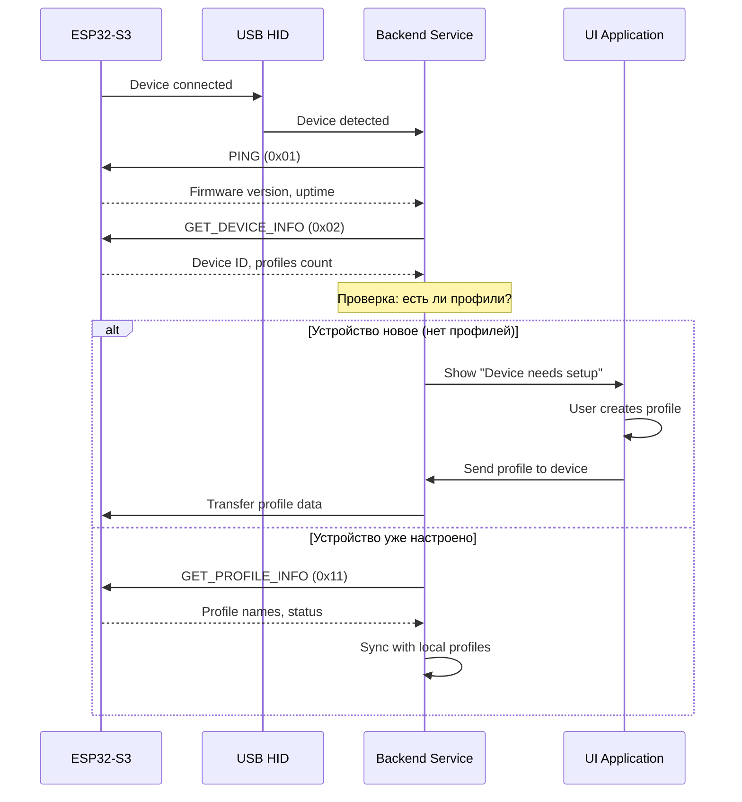
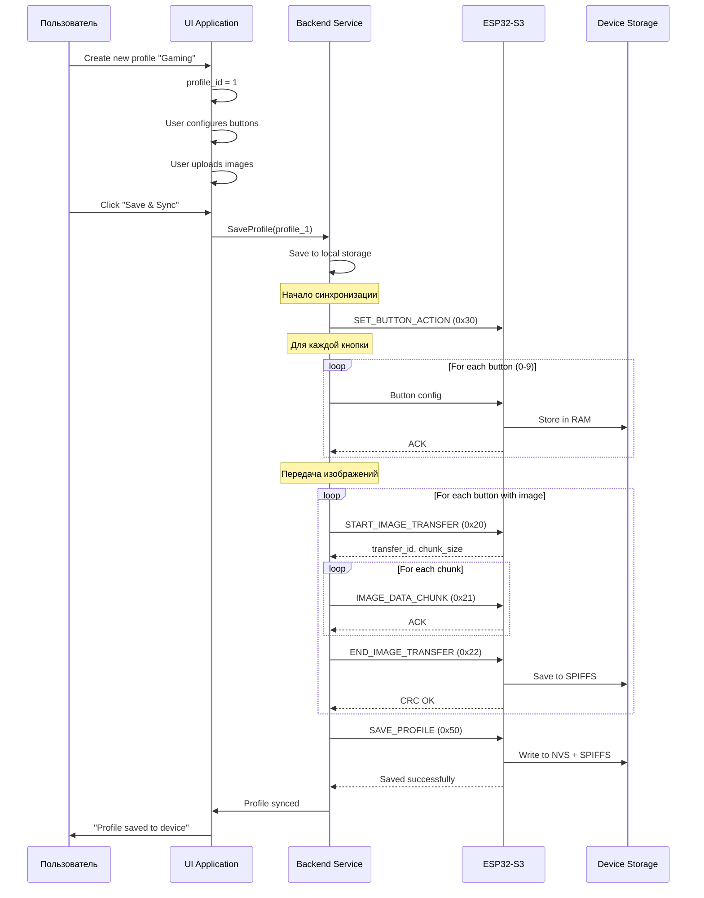
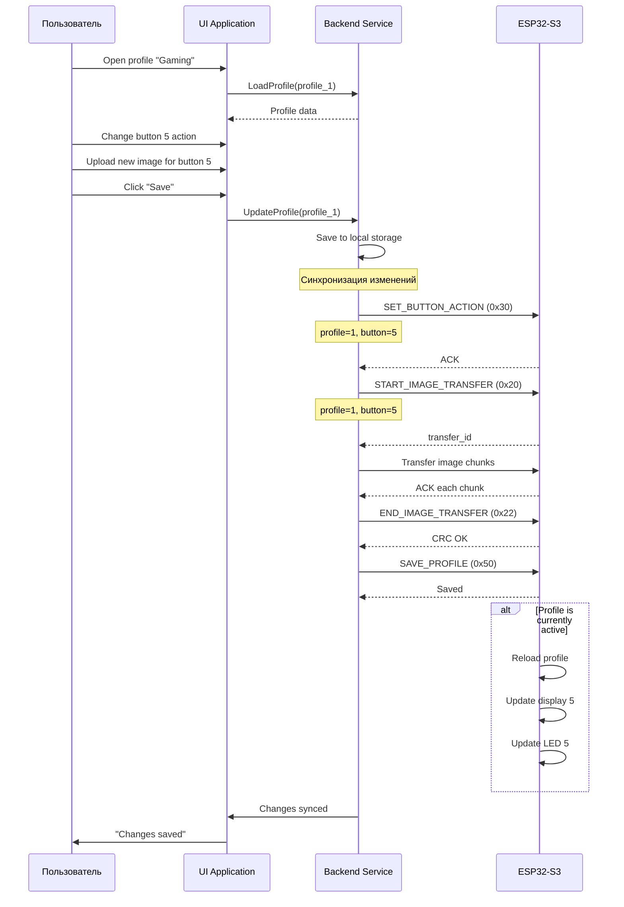
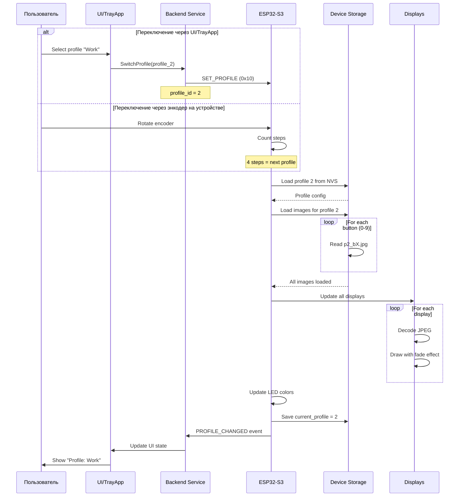
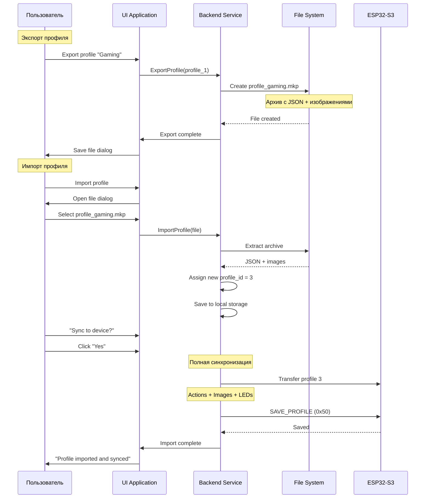
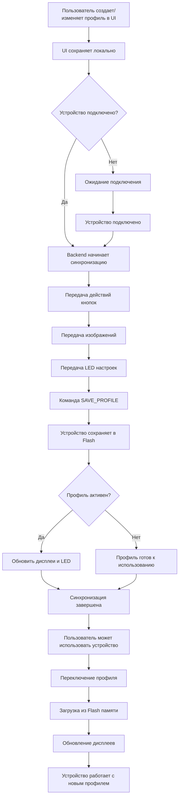

# Как профили попадают в устройство

Этот документ детально объясняет процесс синхронизации профилей между управляющим софтом на ПК и устройством ESP32-S3.

## 📋 Содержание

- [Общая концепция](#общая-концепция)
- [Моменты синхронизации](#моменты-синхронизации)
- [Детальный процесс передачи](#детальный-процесс-передачи)
- [Хранение на устройстве](#хранение-на-устройстве)
- [Примеры сценариев](#примеры-сценариев)

---

## Общая концепция

### Где хранятся профили

**На ПК (управляющий софт):**
```
~/.config/MacroKeyboard/
├── profiles/
│   ├── profile_0.json          # Конфигурация профиля 0
│   ├── profile_1.json          # Конфигурация профиля 1
│   └── ...
└── images/
    ├── profile_0/
    │   ├── button_0.jpg        # Изображение для кнопки 0
    │   ├── button_1.jpg
    │   └── ...
    └── profile_1/
        └── ...
```

**На устройстве ESP32-S3:**
```
Flash Memory:
├── NVS (Non-Volatile Storage)
│   ├── current_profile         # ID активного профиля
│   ├── profile_0_config        # Метаданные профиля 0
│   └── ...
└── SPIFFS (/storage)
    ├── profiles/
    │   ├── profile_0.bin       # Бинарные данные профиля
    │   └── ...
    └── images/
        ├── p0_b0.jpg          # Profile 0, Button 0
        ├── p0_b1.jpg
        └── ...
```

---

## Моменты синхронизации

### 1. Первое подключение устройства



**Когда происходит:**
- При первом запуске Backend после подключения устройства
- Автоматически при обнаружении нового устройства

**Что передается:**
- Ничего, если устройство уже настроено
- Дефолтный профиль, если устройство новое

---

### 2. Создание нового профиля в UI



**Когда происходит:**
- Когда пользователь создает новый профиль в UI
- Когда пользователь нажимает "Save" или "Apply"

**Что передается:**
1. Конфигурация действий для каждой кнопки (команда 0x30)
2. Изображения для каждой кнопки (команды 0x20, 0x21, 0x22)
3. Цвета LED для каждой кнопки (команда 0x40)
4. Команда сохранения профиля (команда 0x50)

---

### 3. Редактирование существующего профиля



**Когда происходит:**
- Когда пользователь изменяет существующий профиль
- Автоматически при изменении (если включена автосинхронизация)
- При нажатии "Save" (если автосинхронизация выключена)

**Что передается:**
- Только измененные данные (оптимизация)
- Если изменено действие кнопки → команда 0x30
- Если изменено изображение → команды 0x20-0x22
- Если изменен цвет LED → команда 0x40
- Команда сохранения → 0x50

---

### 4. Переключение профиля



**Когда происходит:**
- Когда пользователь выбирает профиль в UI или TrayApp
- Когда пользователь вращает энкодер на устройстве
- При старте устройства (загружается последний активный профиль)

**Что передается:**
- Только команда переключения (0x10) с ID профиля
- Данные профиля уже находятся на устройстве!

---

### 5. Импорт/Экспорт профиля



**Когда происходит:**
- Когда пользователь импортирует профиль из файла
- Когда пользователь делится профилем с другими

**Что передается:**
- Весь профиль целиком (как при создании нового)

---

## Детальный процесс передачи

### Передача действия кнопки

**Команда:** `SET_BUTTON_ACTION (0x30)`

```c
// Пример: Настройка кнопки для Ctrl+C
Packet packet = {
    .magic = 0xA5,
    .command = 0x30,  // SET_BUTTON_ACTION
    .payload_length = 10,
    .sequence = 0,
    .payload = {
        0,      // profile_id = 0
        3,      // button_id = 3
        0x01,   // action_type = Keyboard
        0x07,   // data_length = 7
        0x01,   // modifier = Ctrl (bit 0)
        0x06,   // keycode = 'C'
        0x00, 0x00, 0x00, 0x00, 0x00  // unused keycodes
    },
    .checksum = 0xXX,
    .end = 0x5A
};
```

**Размер:** 1 пакет (64 байта)

**Время:** ~10 мс на кнопку

**Для 10 кнопок:** ~100 мс

---

### Передача изображения

**Команды:** `START_IMAGE_TRANSFER (0x20)` → `IMAGE_DATA_CHUNK (0x21)` × N → `END_IMAGE_TRANSFER (0x22)`

```
Изображение: 160×160 пикселей, JPEG, ~10 КБ

1. START_IMAGE_TRANSFER
   - Размер: 10240 байт
   - Формат: JPEG
   - Разрешение: 160×160

2. IMAGE_DATA_CHUNK × 205 раз
   - Chunk size: 50 байт
   - Total chunks: 10240 / 50 = 205
   - Каждый chunk: ~15 мс (передача + ACK)

3. END_IMAGE_TRANSFER
   - CRC32 проверка
   - Сохранение в SPIFFS
```

**Время передачи одного изображения:**
- Передача данных: 205 × 15 мс = ~3 секунды
- Сохранение в SPIFFS: ~500 мс
- **Итого: ~3.5 секунды на изображение**

**Для 10 изображений:** ~35 секунд

---

### Полная синхронизация профиля

```
Профиль с 10 кнопками:
├── Действия кнопок: 10 × 10 мс = 100 мс
├── Изображения: 10 × 3.5 сек = 35 сек
├── LED цвета: 10 × 10 мс = 100 мс
└── Сохранение: 1 × 500 мс = 500 мс

Итого: ~36 секунд
```

**Оптимизация:**
- Передаются только измененные данные
- Изображения сжимаются в JPEG (160×160 RGB → ~10 КБ)
- Используется CRC для проверки целостности

---

## Хранение на устройстве

### NVS (Non-Volatile Storage)

Хранит метаданные и настройки:

```c
// Структура в NVS
nvs_namespace: "profiles"
├── "current_profile" → uint8_t (0-4)
├── "profile_0_name" → string[32]
├── "profile_0_configured" → bool
├── "profile_1_name" → string[32]
└── ...

// Размер: ~1 КБ на профиль
```

### SPIFFS (Flash File System)

Хранит бинарные данные профилей и изображения:

```
/storage/
├── profiles/
│   ├── profile_0.bin    (~2 КБ)
│   │   ├── Button actions (10 × 64 байт)
│   │   ├── LED colors (10 × 4 байт)
│   │   └── Metadata
│   └── profile_1.bin
└── images/
    ├── p0_b0.jpg        (~10 КБ)
    ├── p0_b1.jpg
    └── ...              (50 изображений × 10 КБ = 500 КБ)

Итого: ~600 КБ для 5 профилей
```

### Размер Flash памяти

```
ESP32-S3 Flash: 16 МБ
├── Bootloader: 32 КБ
├── Partition table: 4 КБ
├── NVS: 20 КБ
├── OTA_0: 2 МБ (прошивка)
├── OTA_1: 2 МБ (резерв для OTA)
└── SPIFFS: ~12 МБ (данные)
    └── Профили: ~600 КБ (5 профилей)
    └── Свободно: ~11.4 МБ
```

**Вывод:** Места достаточно для 50+ профилей!

---

## Примеры сценариев

### Сценарий 1: Первая настройка устройства

```
1. Пользователь подключает новое устройство
   ↓
2. Backend обнаруживает устройство
   ↓
3. Backend проверяет: GET_DEVICE_INFO
   → Устройство пустое (0 профилей)
   ↓
4. UI показывает: "Setup your first profile"
   ↓
5. Пользователь создает профиль "Default"
   - Настраивает 10 кнопок
   - Загружает 10 изображений
   ↓
6. Пользователь нажимает "Save & Sync"
   ↓
7. Backend передает профиль на устройство
   - Действия: 100 мс
   - Изображения: 35 сек
   - Сохранение: 500 мс
   ↓
8. Устройство готово к работе!
   - Профиль 0 активен
   - Дисплеи показывают изображения
   - Кнопки работают
```

**Время:** ~36 секунд

---

### Сценарий 2: Быстрое изменение одной кнопки

```
1. Пользователь открывает профиль "Gaming"
   ↓
2. Изменяет действие кнопки 5: F5 → Ctrl+R
   ↓
3. Нажимает "Save"
   ↓
4. Backend синхронизирует:
   - SET_BUTTON_ACTION (кнопка 5): 10 мс
   - SAVE_PROFILE: 500 мс
   ↓
5. Готово!
```

**Время:** ~510 мс (полсекунды!)

---

### Сценарий 3: Смена изображения

```
1. Пользователь открывает профиль "Work"
   ↓
2. Загружает новое изображение для кнопки 3
   ↓
3. Нажимает "Save"
   ↓
4. Backend синхронизирует:
   - START_IMAGE_TRANSFER: 10 мс
   - IMAGE_DATA_CHUNK × 205: 3 сек
   - END_IMAGE_TRANSFER: 500 мс
   - SAVE_PROFILE: 500 мс
   ↓
5. Дисплей обновляется автоматически
```

**Время:** ~4 секунды

---

### Сценарий 4: Переключение профиля

```
1. Пользователь вращает энкодер на устройстве
   ↓
2. Устройство переключается на следующий профиль
   - Профиль уже в памяти!
   - Загрузка из SPIFFS: 100 мс
   - Обновление дисплеев: 500 мс
   - Обновление LED: 10 мс
   ↓
3. Готово!
```

**Время:** ~610 мс

**Важно:** Данные профиля уже на устройстве, синхронизация не нужна!

---

## Ключевые моменты

### ✅ Когда данные передаются

1. **При создании профиля** - полная передача
2. **При редактировании** - только измененные данные
3. **При импорте** - полная передача
4. **При первом подключении** - проверка и синхронизация

### ❌ Когда данные НЕ передаются

1. **При переключении профиля** - данные уже на устройстве
2. **При нажатии кнопок** - действия уже настроены
3. **При старте устройства** - загружается из памяти

### 🚀 Оптимизации

1. **Инкрементальная синхронизация** - только изменения
2. **Сжатие изображений** - JPEG вместо RAW
3. **Кэширование** - профили хранятся на устройстве
4. **Фоновая синхронизация** - не блокирует UI

### 💾 Персистентность

- Профили сохраняются в Flash памяти
- Данные сохраняются при отключении питания
- Не требуется постоянное подключение к ПК
- Устройство работает автономно

---

## Диаграмма полного цикла



---

## Связанная документация

- [`plans/protocol.md`](protocol.md) - Детальное описание протокола
- [`plans/system_flow.md`](system_flow.md) - Диаграммы взаимодействия
- [`plans/storage.md`](storage.md) - Организация хранения данных
- [`software/plans/architecture.md`](../software/plans/architecture.md) - Архитектура софта
- [`firmware/README.md`](../firmware/README.md) - Структура прошивки
