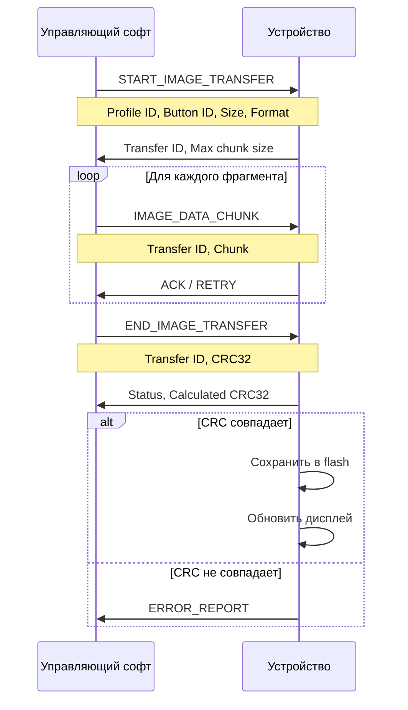
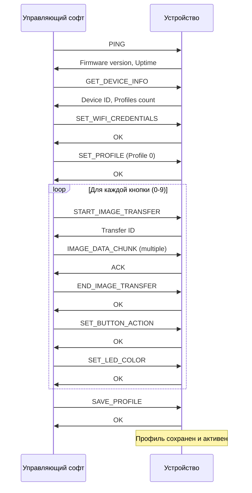

# Протокол обмена данными между управляющим софтом и устройством

## Общая информация

Устройство подключается к компьютеру через USB и определяется как:
1. **USB HID Keyboard** - для эмуляции нажатий клавиш
2. **USB HID Raw Device** - для двунаправленного обмена данными и пользовательских команд
3. **USB CDC (UART)** - для логирования диагностических данных (опционально)

## USB HID Raw протокол

### Параметры HID Raw интерфейса

- **Report ID**: 0x01 (для конфигурационных команд)
- **Report Size**: 64 байта (стандартный размер для Full Speed USB)
- **Endpoint**: Bidirectional (IN/OUT)

### Структура пакета

Все пакеты имеют единую структуру:

```
Байт 0: MAGIC_BYTE (0xA5) - маркер начала пакета
Байт 1: COMMAND_ID - идентификатор команды
Байт 2-3: PAYLOAD_LENGTH (little-endian) - длина полезной нагрузки
Байт 4-5: SEQUENCE_NUMBER (little-endian) - номер пакета в последовательности
Байт 6-61: PAYLOAD - полезная нагрузка (56 байт)
Байт 62: CHECKSUM - контрольная сумма (XOR всех байтов 0-61)
Байт 63: END_BYTE (0x5A) - маркер конца пакета
```

### Команды от управляющего софта к устройству

#### 0x01 - PING
Проверка связи с устройством.

**Запрос:**
- Payload: пусто

**Ответ:**
- Payload: 
  - Байт 0-3: Firmware version (major.minor.patch.build)
  - Байт 4-7: Uptime в секундах
  - Байт 8: Current profile ID

#### 0x02 - GET_DEVICE_INFO
Получение информации об устройстве.

**Запрос:**
- Payload: пусто

**Ответ:**
- Payload:
  - Байт 0-15: Device ID (UUID)
  - Байт 16-19: Firmware version
  - Байт 20: Number of buttons (10)
  - Байт 21: Number of profiles (3-5)
  - Байт 22: Current profile
  - Байт 23-26: Free flash space (bytes)

#### 0x10 - SET_PROFILE
Переключение активного профиля.

**Запрос:**
- Payload:
  - Байт 0: Profile ID (0-4)

**Ответ:**
- Payload:
  - Байт 0: Status (0x00 = OK, 0xFF = Error)
  - Байт 1: Current profile ID

#### 0x11 - GET_PROFILE_INFO
Получение информации о профиле.

**Запрос:**
- Payload:
  - Байт 0: Profile ID (0-4)

**Ответ:**
- Payload:
  - Байт 0: Profile ID
  - Байт 1-32: Profile name (UTF-8, null-terminated)
  - Байт 33: Is configured (0x00 = No, 0x01 = Yes)

#### 0x20 - START_IMAGE_TRANSFER
Начало передачи изображения для кнопки.

**Запрос:**
- Payload:
  - Байт 0: Profile ID (0-4)
  - Байт 1: Button ID (0-9)
  - Байт 2-5: Image size in bytes (little-endian)
  - Байт 6: Image format (0x01 = JPEG, 0x02 = RGB565)
  - Байт 7-8: Image width (160)
  - Байт 9-10: Image height (160)

**Ответ:**
- Payload:
  - Байт 0: Status (0x00 = OK, 0xFF = Error)
  - Байт 1-2: Transfer ID (для последующих пакетов)
  - Байт 3-4: Max chunk size (обычно 56 байт)

#### 0x21 - IMAGE_DATA_CHUNK
Передача фрагмента изображения.

**Запрос:**
- Payload:
  - Байт 0-1: Transfer ID
  - Байт 2-3: Chunk number (начиная с 0)
  - Байт 4-5: Chunk size (до 50 байт)
  - Байт 6-55: Image data

**Ответ:**
- Payload:
  - Байт 0: Status (0x00 = OK, 0x01 = Retry, 0xFF = Error)
  - Байт 1-2: Next expected chunk number

#### 0x22 - END_IMAGE_TRANSFER
Завершение передачи изображения.

**Запрос:**
- Payload:
  - Байт 0-1: Transfer ID
  - Байт 2-5: Total chunks sent
  - Байт 6-9: CRC32 всего изображения

**Ответ:**
- Payload:
  - Байт 0: Status (0x00 = OK, 0xFF = Error)
  - Байт 1-4: Calculated CRC32

#### 0x30 - SET_BUTTON_ACTION
Установка действия для кнопки.

**Запрос:**
- Payload:
  - Байт 0: Profile ID (0-4)
  - Байт 1: Button ID (0-9)
  - Байт 2: Action type (0x01 = Keyboard, 0x02 = Custom HID)
  - Байт 3-4: Action data length
  - Байт 5-54: Action data

**Action data для Keyboard (type 0x01):**
- Байт 0: Modifier keys (Ctrl, Shift, Alt, GUI битовая маска)
- Байт 1-6: HID keycodes (до 6 одновременных клавиш)
- Байт 7-N: Text to type (UTF-8, если нужно печатать текст)

**Action data для Custom HID (type 0x02):**
- Байт 0-49: Custom HID report data (до 50 байт)

**Ответ:**
- Payload:
  - Байт 0: Status (0x00 = OK, 0xFF = Error)

#### 0x40 - SET_LED_COLOR
Установка цвета RGB светодиода для кнопки.

**Запрос:**
- Payload:
  - Байт 0: Profile ID (0-4)
  - Байт 1: Button ID (0-9, или 0xFF для всех)
  - Байт 2: Red (0-255)
  - Байт 3: Green (0-255)
  - Байт 4: Blue (0-255)
  - Байт 5: Brightness (0-255)
  - Байт 6: Effect (0x00 = Static, 0x01 = Breathing, 0x02 = Rainbow)

**Ответ:**
- Payload:
  - Байт 0: Status (0x00 = OK, 0xFF = Error)

#### 0x50 - SAVE_PROFILE
Сохранение профиля в энергонезависимую память.

**Запрос:**
- Payload:
  - Байт 0: Profile ID (0-4)

**Ответ:**
- Payload:
  - Байт 0: Status (0x00 = OK, 0xFF = Error)
  - Байт 1-4: Bytes written

#### 0x51 - LOAD_PROFILE
Загрузка профиля из энергонезависимой памяти.

**Запрос:**
- Payload:
  - Байт 0: Profile ID (0-4)

**Ответ:**
- Payload:
  - Байт 0: Status (0x00 = OK, 0xFF = Error)

#### 0x52 - DELETE_PROFILE
Удаление профиля.

**Запрос:**
- Payload:
  - Байт 0: Profile ID (0-4)

**Ответ:**
- Payload:
  - Байт 0: Status (0x00 = OK, 0xFF = Error)

#### 0x60 - START_OTA_UPDATE
Начало OTA обновления через WiFi.

**Запрос:**
- Payload:
  - Байт 0-3: Firmware size (bytes)
  - Байт 4-35: Firmware URL (null-terminated string)
  - Байт 36-51: MD5 hash (16 bytes)

**Ответ:**
- Payload:
  - Байт 0: Status (0x00 = Started, 0xFF = Error)

#### 0x61 - GET_OTA_STATUS
Получение статуса OTA обновления.

**Запрос:**
- Payload: пусто

**Ответ:**
- Payload:
  - Байт 0: Status (0x00 = Idle, 0x01 = Downloading, 0x02 = Installing, 0x03 = Complete, 0xFF = Error)
  - Байт 1: Progress (0-100%)
  - Байт 2-5: Bytes downloaded

#### 0x70 - SET_WIFI_CREDENTIALS
Установка WiFi учетных данных для OTA.

**Запрос:**
- Payload:
  - Байт 0-31: SSID (null-terminated)
  - Байт 32-63: Password (null-terminated, продолжение в следующем пакете если нужно)

**Ответ:**
- Payload:
  - Байт 0: Status (0x00 = OK, 0xFF = Error)

#### 0x71 - GET_WIFI_STATUS
Получение статуса WiFi подключения.

**Запрос:**
- Payload: пусто

**Ответ:**
- Payload:
  - Байт 0: Status (0x00 = Disconnected, 0x01 = Connecting, 0x02 = Connected, 0xFF = Error)
  - Байт 1: Signal strength (RSSI, -128 to 0)
  - Байт 2-5: IP address (4 bytes)
  - Байт 6-37: SSID (null-terminated)

#### 0x80 - ENABLE_DEBUG_LOG
Включение/выключение логирования через USB CDC.

**Запрос:**
- Payload:
  - Байт 0: Enable (0x00 = Disable, 0x01 = Enable)
  - Байт 1: Log level (0 = Error, 1 = Warning, 2 = Info, 3 = Debug, 4 = Verbose)

**Ответ:**
- Payload:
  - Байт 0: Status (0x00 = OK, 0xFF = Error)

#### 0x81 - FACTORY_RESET
Сброс устройства к заводским настройкам.

**Запрос:**
- Payload:
  - Байт 0-3: Confirmation code (0xDEADBEEF)

**Ответ:**
- Payload:
  - Байт 0: Status (0x00 = OK, 0xFF = Error)

### Команды от устройства к управляющему софту

#### 0xF0 - BUTTON_PRESSED
Уведомление о нажатии кнопки (для custom HID действий).

**Payload:**
- Байт 0: Button ID (0-9)
- Байт 1: Profile ID
- Байт 2: Action type
- Байт 3-52: Custom data (если action type = 0x02)

#### 0xF1 - ENCODER_ROTATED
Уведомление о вращении энкодера.

**Payload:**
- Байт 0: Direction (0x00 = CCW, 0x01 = CW)
- Байт 1: Steps count
- Байт 2: New profile ID (если произошло переключение)

#### 0xF2 - ENCODER_BUTTON_PRESSED
Уведомление о нажатии кнопки энкодера.

**Payload:**
- Байт 0: Press type (0x01 = Short, 0x02 = Long)

#### 0xF3 - PROFILE_CHANGED
Уведомление о смене профиля.

**Payload:**
- Байт 0: Old profile ID
- Байт 1: New profile ID
- Байт 2: Change reason (0x01 = Encoder, 0x02 = Command, 0x03 = Boot)

#### 0xFE - ERROR_REPORT
Сообщение об ошибке.

**Payload:**
- Байт 0: Error code
- Байт 1-50: Error message (null-terminated UTF-8)

**Error codes:**
- 0x01: Memory allocation failed
- 0x02: Flash write error
- 0x03: Display communication error
- 0x04: Invalid command
- 0x05: Invalid parameter
- 0x06: Profile not found
- 0x07: Image transfer error
- 0x08: WiFi connection error
- 0x09: OTA update error

## Формат изображений

### Рекомендуемый формат: JPEG

**Обоснование:**
- Размер изображения 160x160 в RGB565 = 51,200 байт
- JPEG сжатие может уменьшить размер до 5-15 КБ (в зависимости от сложности)
- ESP32-S3 имеет аппаратный JPEG декодер
- Для 10 кнопок и 5 профилей: 50 изображений × 10 КБ = 500 КБ (вместо 2.5 МБ для raw)

**Альтернатива: RGB565 raw**
- Используется если нужна максимальная скорость отрисовки
- Изображение передается уже в формате дисплея
- Занимает больше места в flash памяти

### Процесс передачи изображения



## USB HID Keyboard протокол

Устройство использует стандартный USB HID Keyboard протокол для эмуляции нажатий клавиш.

### HID Report Descriptor

Стандартный 8-байтовый keyboard report:
- Байт 0: Modifier keys (Ctrl, Shift, Alt, GUI)
- Байт 1: Reserved (0x00)
- Байт 2-7: Keycodes (до 6 одновременных клавиш)

### Эмуляция печати текста

Для команд типа "напечатать текст":
1. Устройство разбивает UTF-8 текст на символы
2. Для каждого символа определяет соответствующий HID keycode
3. Отправляет последовательность HID reports с задержкой 10-20 мс
4. Поддерживает латиницу, цифры, спецсимволы

## USB CDC (UART) логирование

### Формат лог-сообщений

```
[TIMESTAMP] [LEVEL] [MODULE] Message
```

Пример:
```
[00:01:23.456] [INFO] [DISPLAY] Button 0 image updated
[00:01:24.789] [DEBUG] [USB] HID report sent: 0x04 0x00 0x00...
[00:01:25.012] [ERROR] [FLASH] Write failed at address 0x310000
```

### Уровни логирования

- **ERROR**: Критические ошибки
- **WARNING**: Предупреждения
- **INFO**: Информационные сообщения
- **DEBUG**: Отладочная информация
- **VERBOSE**: Детальная трассировка

## Безопасность и надежность

### Контрольные суммы

Все пакеты содержат XOR checksum для обнаружения ошибок передачи.

### Тайм-ауты

- Ожидание ответа на команду: 1000 мс
- Тайм-аут передачи изображения: 30 секунд
- Тайм-аут OTA обновления: 5 минут

### Повторные попытки

- Автоматический retry при ошибке передачи (до 3 попыток)
- Экспоненциальная задержка между попытками

### Защита flash памяти

- Wear leveling для равномерного износа
- Проверка CRC при загрузке профилей
- Резервное копирование критических данных

## Пример последовательности настройки устройства



## Производительность

### Скорость передачи данных

- USB Full Speed: 12 Мбит/с
- Реальная пропускная способность HID Raw: ~1 МБ/с
- Время передачи одного изображения (10 КБ JPEG): ~100-200 мс
- Время настройки всех 10 кнопок: ~2-3 секунды

### Задержки

- Отклик на нажатие кнопки: < 10 мс
- Переключение профиля: < 100 мс
- Обновление дисплея: < 50 мс
- HID keyboard report: < 5 мс
