# Диаграммы взаимодействия компонентов системы

## Общая архитектура системы

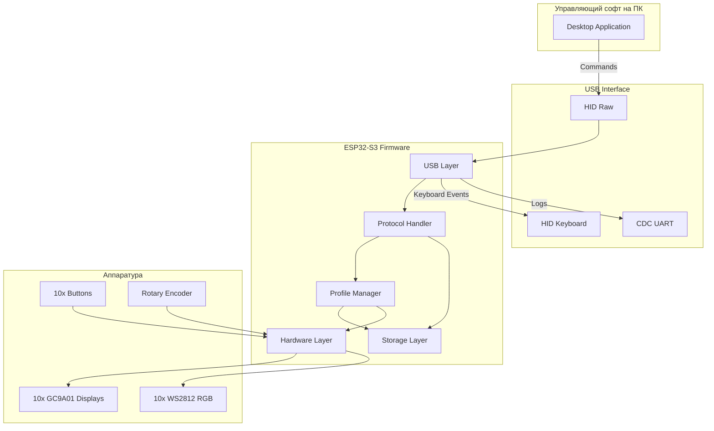

## Процесс инициализации устройства

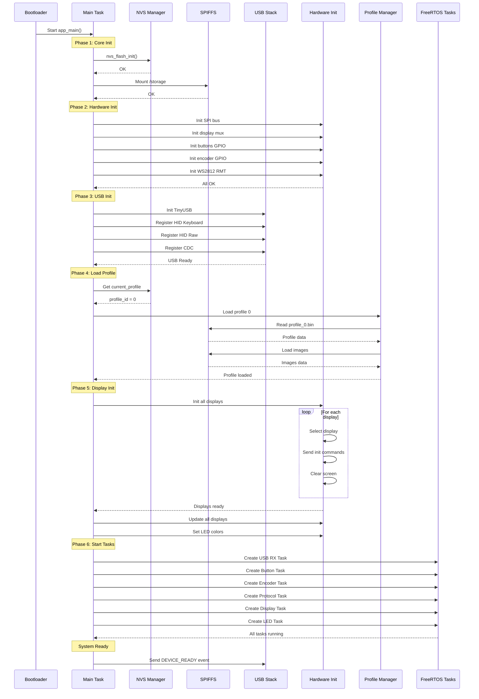

## Обработка нажатия кнопки

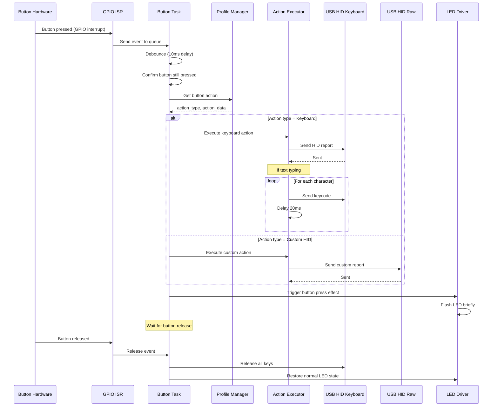

## Переключение профиля через энкодер

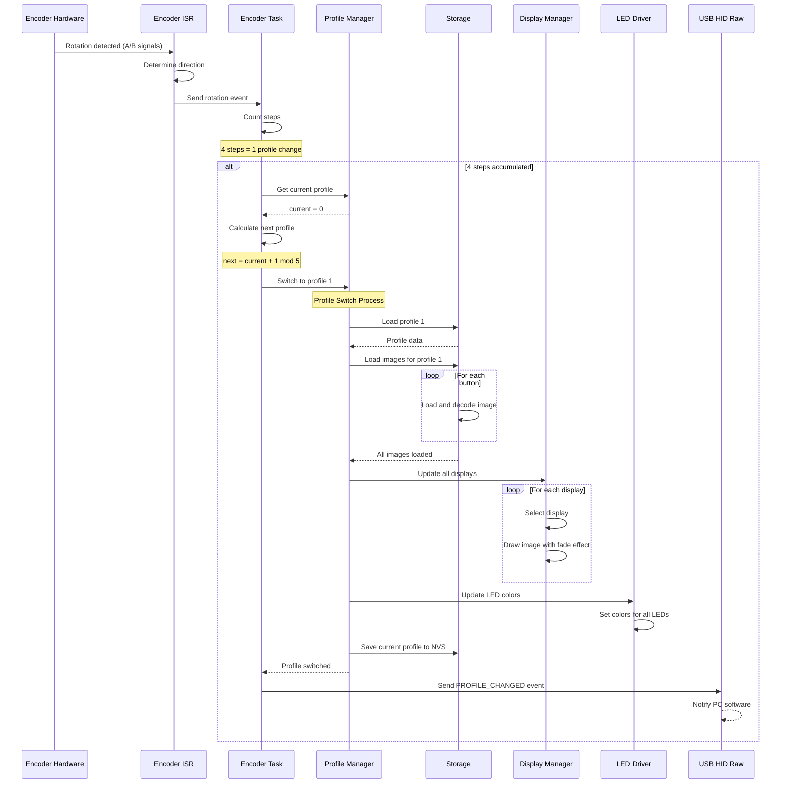

## Передача изображения от ПК

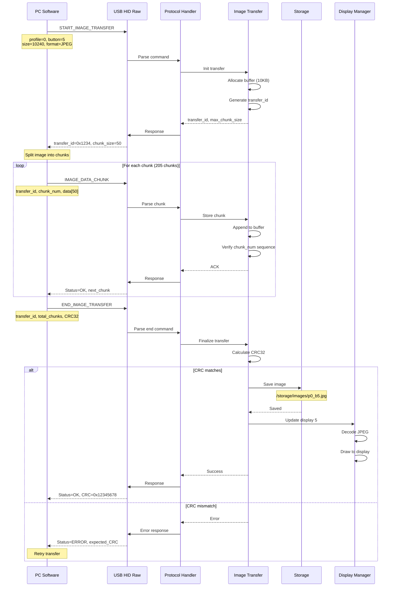

## WiFi OTA обновление

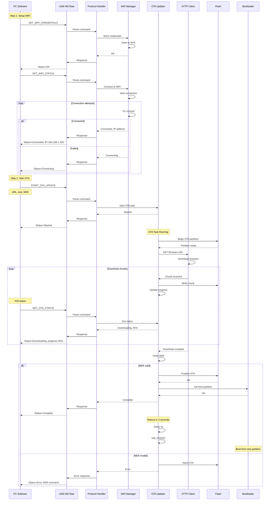

## Работа Display Task

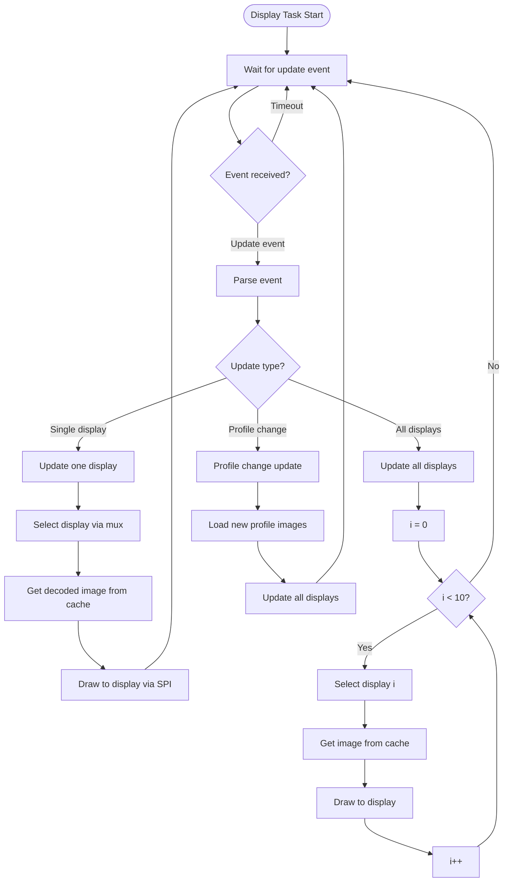

## Работа Button Task

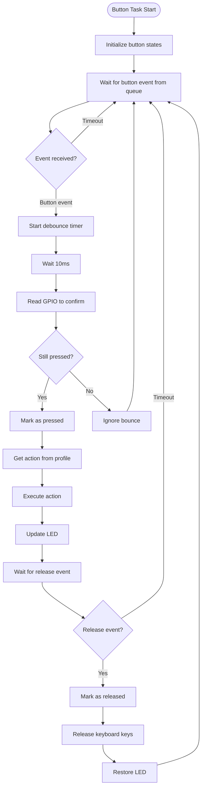

**Примечание**: События генерируются GPIO ISR, polling не используется.

## Взаимодействие с кэшем изображений

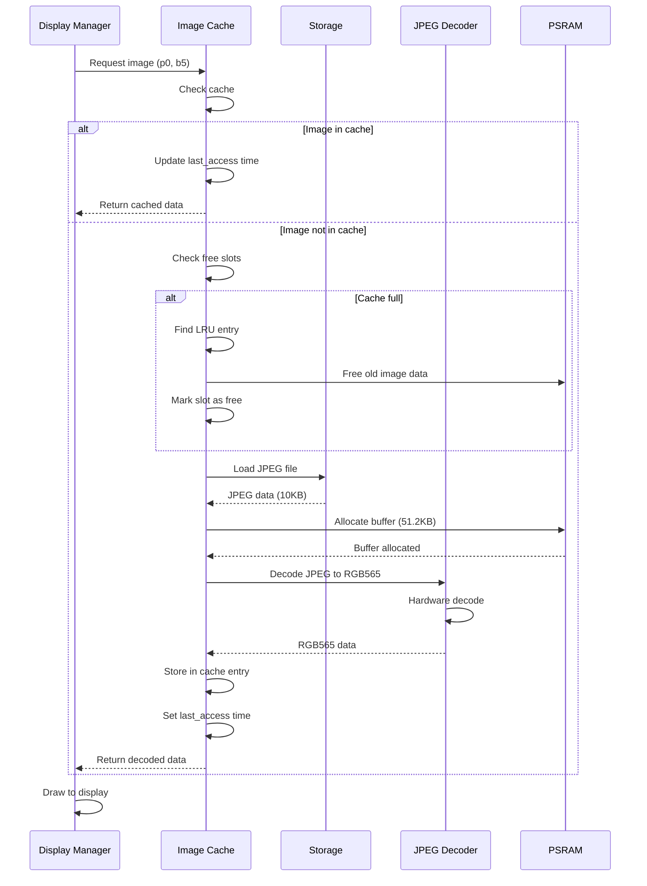

## Обработка ошибок и восстановление

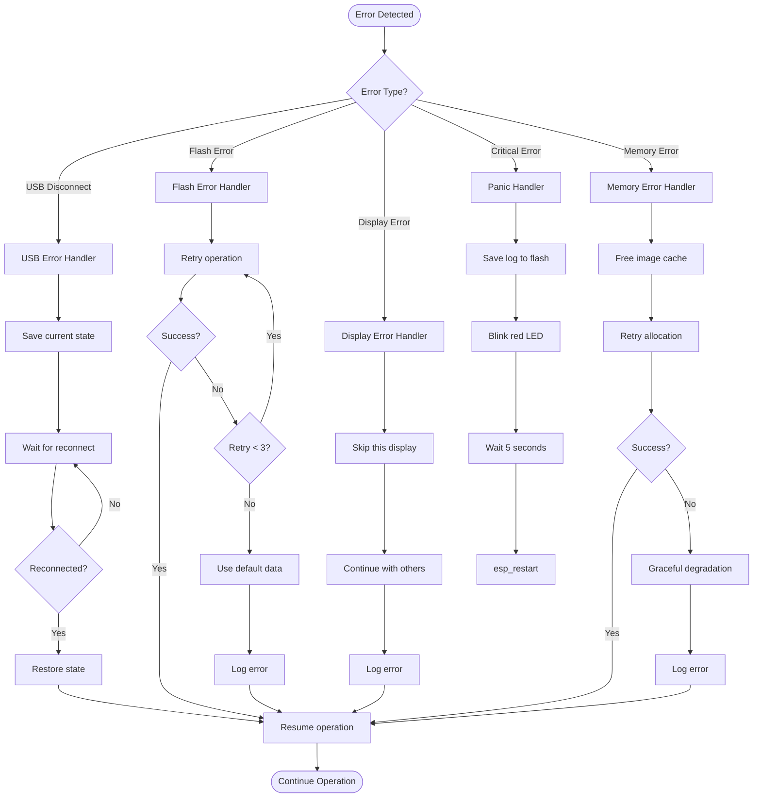

## Диаграмма состояний устройства

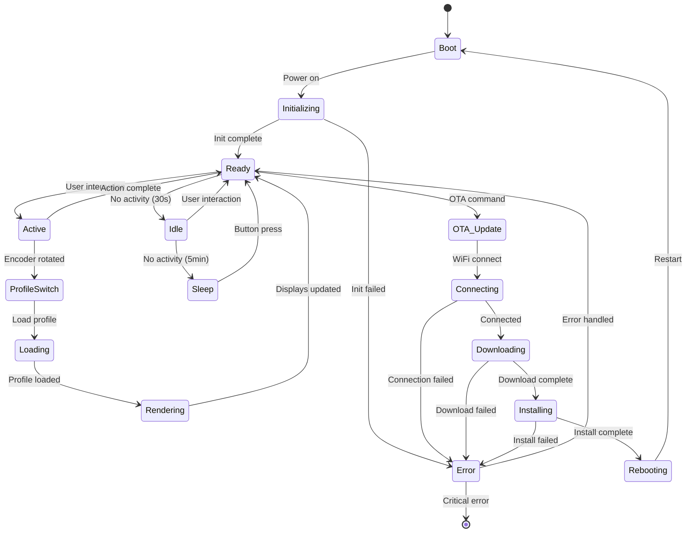

## Временная диаграмма критического пути

```mermaid
gantt
    title Button Press to Action Execution
    dateFormat SSS
    axisFormat %L ms
    
    section Hardware
    Button pressed           :000, 1ms
    GPIO interrupt           :001, 1ms
    
    section Software
    ISR handler              :002, 1ms
    Queue send               :003, 1ms
    Task wakeup              :004, 1ms
    Debounce delay           :005, 10ms
    Confirm press            :015, 1ms
    
    section Action
    Get action from profile  :016, 1ms
    Execute action           :017, 2ms
    Send USB HID report      :019, 1ms
    
    section Feedback
    LED flash effect         :020, 5ms
    
    Total latency: ~20ms from press to action
```

## Диаграмма использования памяти

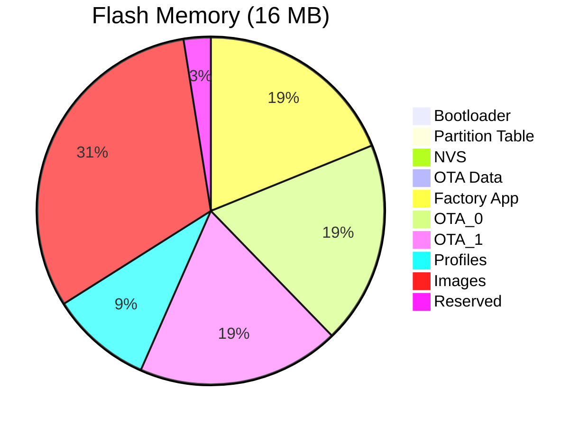

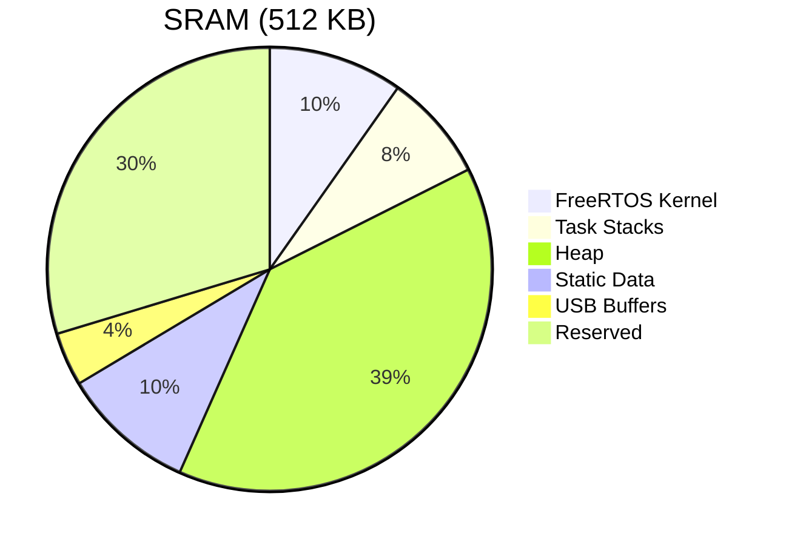

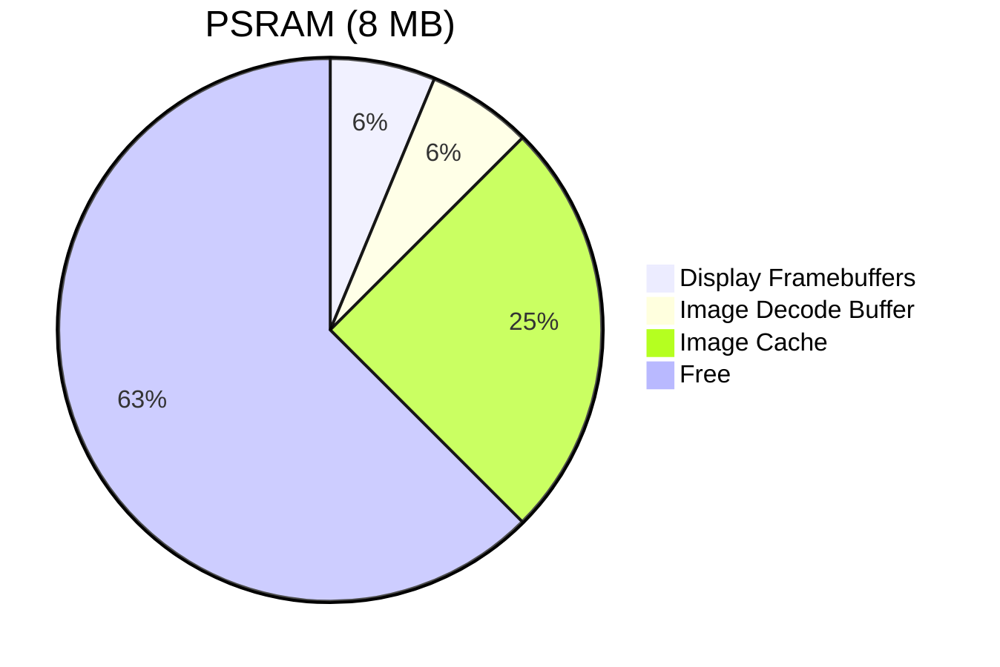
