# Диаграммы взаимодействия управляющего софта

## Архитектура приложения

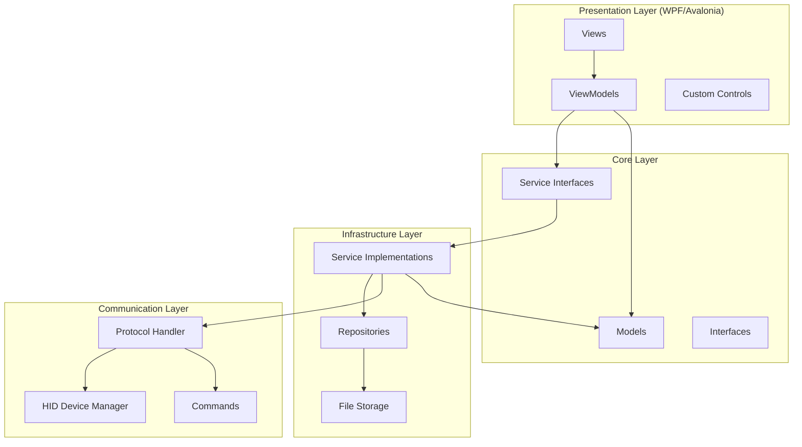

## Запуск приложения

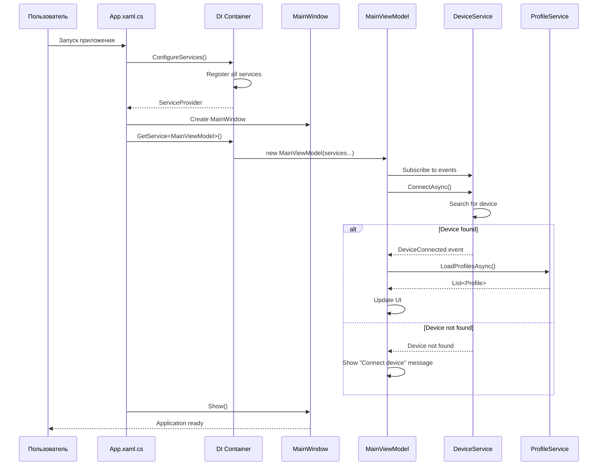

## Подключение к устройству

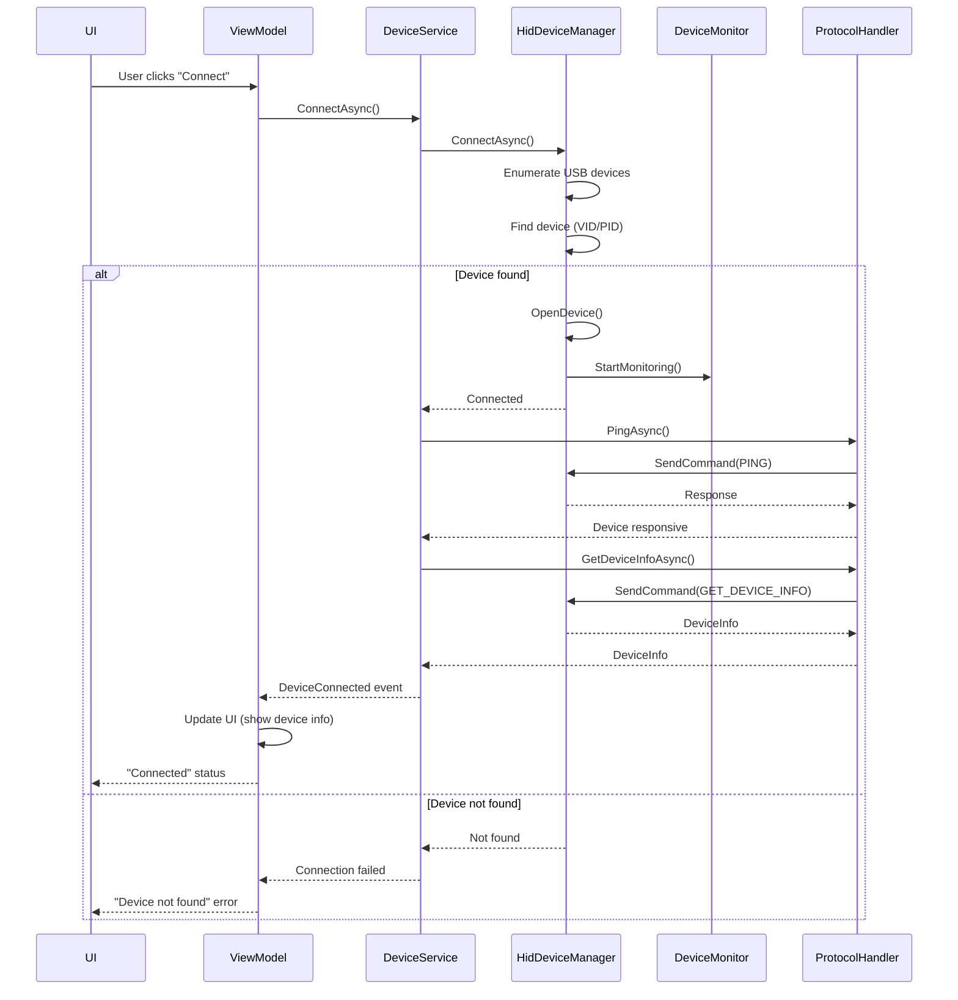

## Создание и настройка профиля

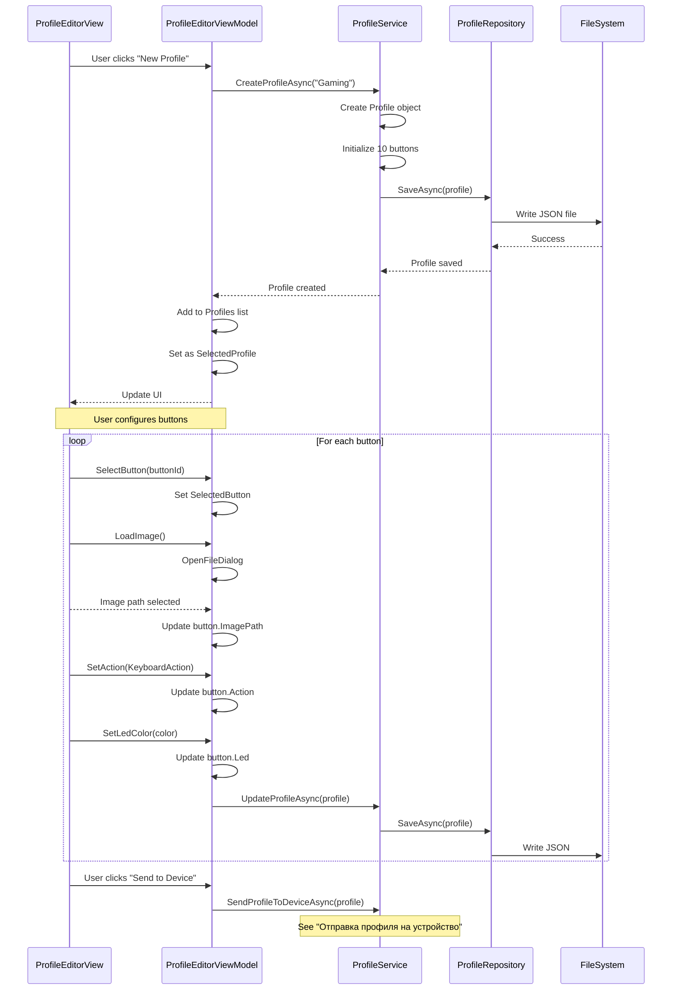

## Отправка профиля на устройство

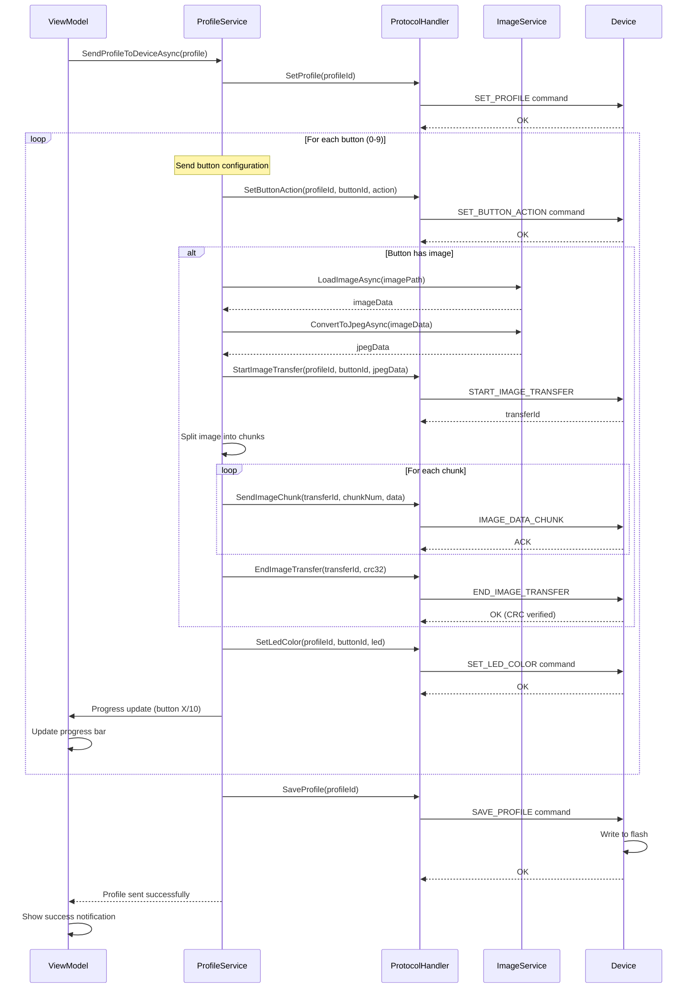

## OTA обновление

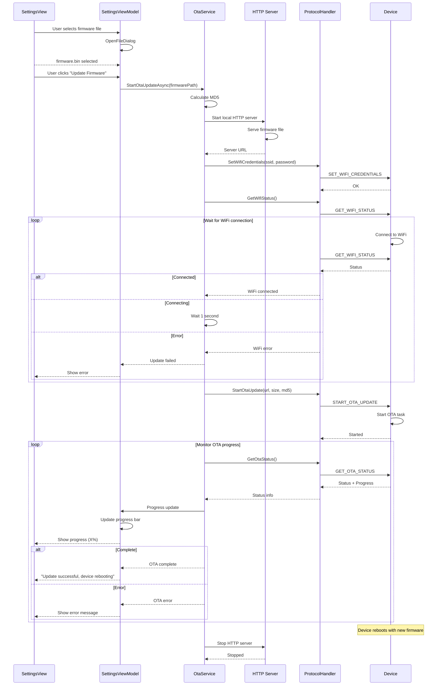

## Tray Application - Переключение профиля

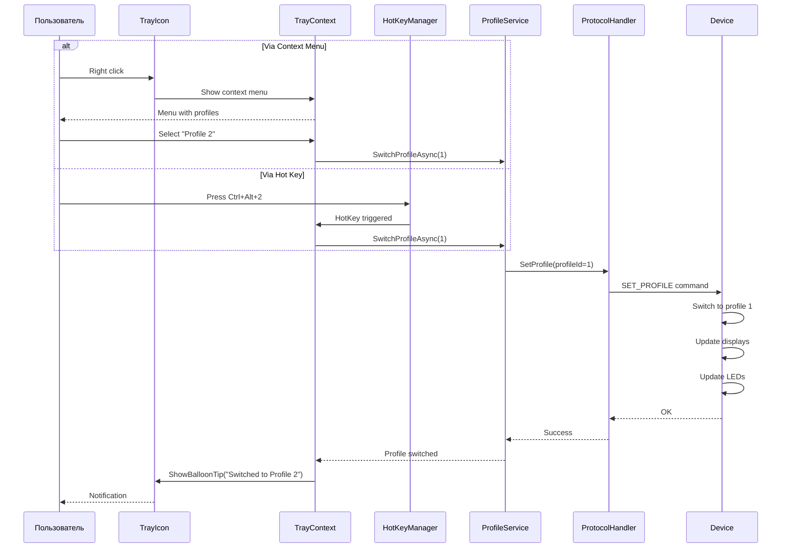

## Диагностика - Просмотр логов

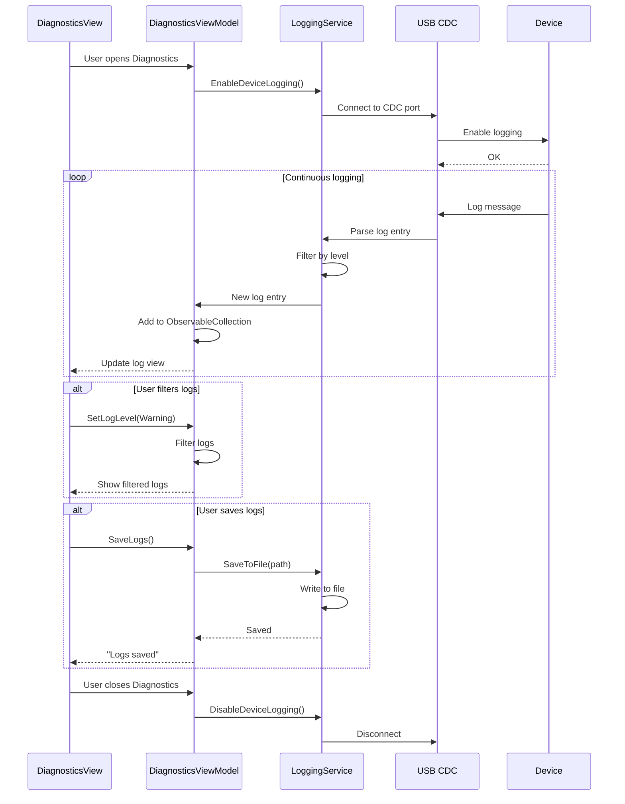

## Обработка ошибок

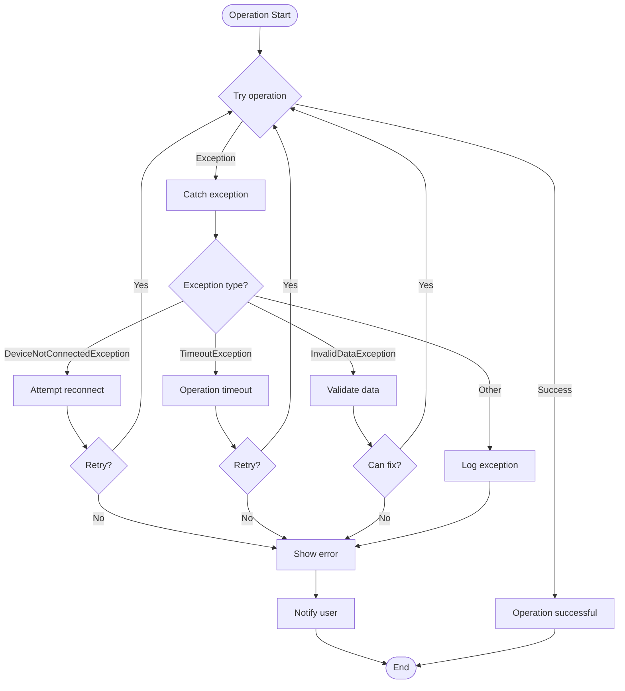

## State Machine приложения

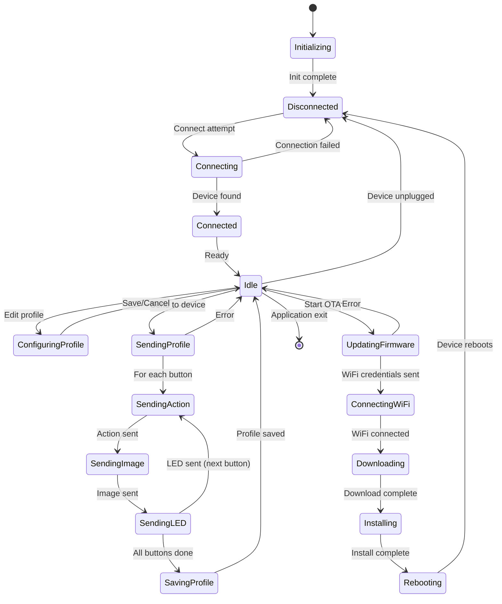

## Архитектура данных

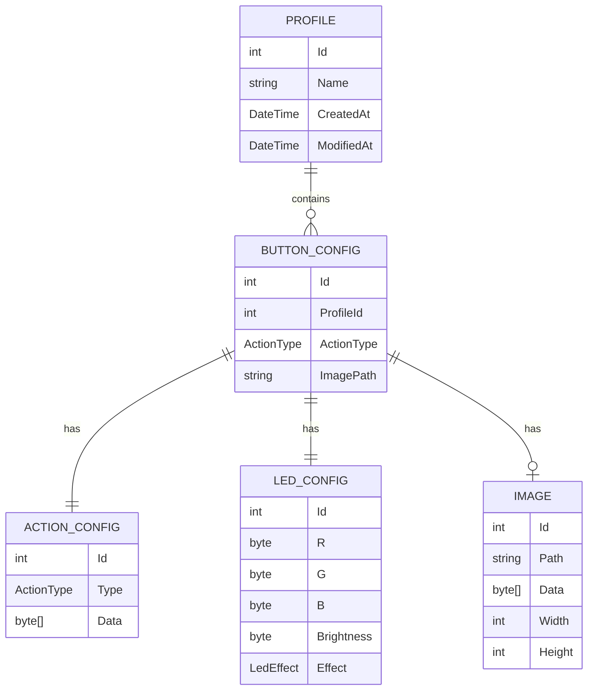

## Поток данных при настройке кнопки

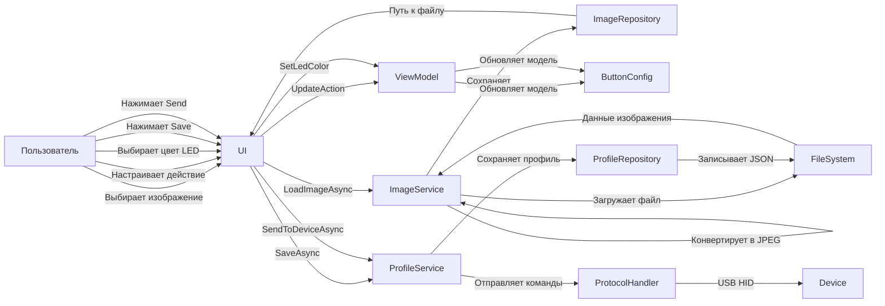

## Многопоточность

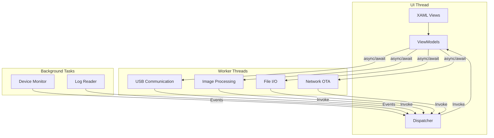

## Производительность

### Целевые показатели

| Операция | Целевое время | Приемлемое время |
|----------|---------------|------------------|
| Запуск приложения | < 2 с | < 3 с |
| Подключение к устройству | < 500 мс | < 1 с |
| Загрузка профиля | < 100 мс | < 200 мс |
| Отправка профиля | < 5 с | < 10 с |
| Обработка изображения | < 500 мс | < 1 с |
| Переключение профиля | < 200 мс | < 500 мс |
| OTA обновление | < 2 мин | < 5 мин |

### Оптимизации

1. **Асинхронные операции**: Все I/O операции async/await
2. **Кэширование**: Кэширование обработанных изображений
3. **Lazy loading**: Загрузка данных по требованию
4. **Виртуализация UI**: Виртуализация списков профилей
5. **Параллелизм**: Параллельная отправка данных на устройство
